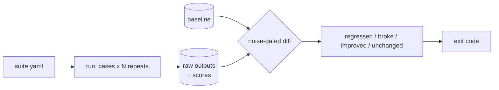

# noisefloor

[](https://github.com/ahmed-hashim-pro/noisefloor/actions/workflows/ci.yml) [](LICENSE)

A regression harness for systems that do not give the same answer twice.

Most eval tooling answers *"what score does this get?"* The question that blocks
a merge is *"did this change make it worse?"* — and on a non-deterministic
system that is unanswerable until you know how much the system moves on its own.

`noisefloor` runs your target N times, measures the spread, and only calls
something a regression when the delta clears it.

```
noisefloor check examples/quickstart/suite.yaml
```

That runs against `examples/quickstart/target.py`, a small canned stand-in
committed alongside it — no model, no API key, no network, no sibling
checkout. It exists so this command works right after a clone. The real
noise measurement — of an actual RAG agent, in `examples/rag-knowledge-agent/`
below — has now been captured: 5 cases, 3 repeats each, against
`claude-sonnet-4-6` with no `temperature` set.

```
5 unchanged
exit 0
no warnings
```

See ["Measured: how noisy is a real RAG agent?"](#measured-how-noisy-is-a-real-rag-agent)
below for the per-scorer bands, what actually varied, and a false positive
the capture found in `noisefloor` itself.

## How it works



## Install

```bash
python -m venv .venv && . .venv/bin/activate     # Windows: .venv\Scripts\activate
pip install -e .
```

Two runtime dependencies, both pinned: `pydantic` and `pyyaml`. No model client,
no API key — `noisefloor` talks to your target over a subprocess and reads JSON
from its stdout.

## A suite

```yaml
name: my-agent
target:
  command: ["my-agent", "--json", "{{input}}"]   # argv list, never a shell string
  timeout_s: 60
defaults:
  repeats: 5
cases:
  - id: refuses-off-topic
    input: What is the recipe for sourdough bread?
    scorers:
      - json_valid
      - {type: contains, needle: "I don't know", path: answer}
      - {type: json_path_equals, path: confidence, value: low}
```

`noisefloor scorers` lists all nine built-ins.

## The significance rule

This is the whole product, so it is worth stating plainly.

**Binary scorers** (`contains`, `regex`, `json_path_equals`, …) compare pass
counts out of N. A regression is either:

- the baseline passed unanimously and the candidate did not — a clean baseline
  observed no variance, so any failure is new behaviour; or
- the pass rate dropped by more than `--min-rate-drop` (default 0.2).

An improvement is reported by the second clause alone, read in reverse — a
pass-rate *gain* past the same threshold. The first clause is anchored to the
baseline and is never mirrored onto the candidate: a candidate reaching
unanimity from a baseline that had already shown variance is unremarkable,
not an improvement, so it reports `unchanged`.

**Continuous scorers** (`json_path_number`, `latency`) require the candidate
mean to fall outside the baseline's observed range *and* to move by more than
`--min-effect`. A continuous scorer with bounds (`min`/`max`/`max_s`) also has
a pass rate, and the binary rule above applies to that pass rate too — either
clause firing is a regression.

The second clause exists because a single range rule breaks on binary scorers:
a unanimous 5/5 baseline has range 0, so any failure looks significant, while a
3/5 baseline has range 1, so a collapse to 0/5 reads as noise.

**The observed range over five samples is not a confidence interval.** This is a
heuristic tuned to keep CI false positives low, not a hypothesis test, and every
report prints the counts behind the verdict so you can overrule it. With one
repeat the report says `noise unmeasured` and refuses to call anything
significant.

## Errors are a third category

A target that exits non-zero, times out, or prints something that is not JSON is
recorded as an *error*, never as a silent pass or fail. A case that errors in the
candidate but not the baseline is reported as **broke** — a different finding
from *regressed*, with its own exit code.

| Exit | Meaning |
| --- | --- |
| 0 | no regression |
| 1 | at least one case regressed |
| 2 | at least one case broke |
| 3 | harness or configuration error |

One thing to know before wiring this into CI: the **first** `check` for a suite
has nothing to compare against, so it adopts its own run as the baseline and
exits 0. That is a pass by absence, not by comparison. On a fresh checkout with
no `.noisefloor/`, the first build is always green — commit a baseline, or run
`check` twice.

## Raw output is kept

Every stdout from every repeat is stored under `.noisefloor/runs/`. Adding or
fixing a scorer costs nothing: `noisefloor rescore` re-applies it to runs you
already paid for. It is also how this project's own test suite stays key-free.

## Measured: how noisy is a real RAG agent?

`examples/rag-knowledge-agent/` points at
[rag-knowledge-agent](https://github.com/ahmed-hashim-pro/rag-knowledge-agent),
unmodified. Model `claude-sonnet-4-6`, no `temperature` set, so it samples at
the API default. Corpus: 44 chunks from 5 files.

Two captures — a baseline, then the identical suite against a target that had
not changed at all — each at **3 repeats per case rather than the suite's
default of 5, to limit API spend**: 5 cases x 3 repeats x 2 captures = **30
model calls** total. Said plainly: a thinner N gives a coarser noise estimate
than the suite's own default would.

The baseline capture: 15 calls, **3 minutes 9 seconds** wall clock, all 5
cases `ok`.

```
5 unchanged
exit 0
no warnings
```

Per scorer, baseline band -> candidate band:

```
charging-bays  [unchanged]
   0:json_valid             3/3  ->  3/3
   1:json_path_in           3/3  ->  3/3
   2:json_path_number       0.543 [0.437–0.597] n=3  ->  0.597 [0.597–0.597] n=3

error-code-409  [unchanged]
   0:json_valid             3/3  ->  3/3
   1:contains               3/3  ->  3/3
   2:json_path_subset       3/3  ->  3/3

offline-behaviour  [unchanged]
   0:json_valid             3/3  ->  3/3
   1:json_path_in           3/3  ->  3/3
   2:json_path_subset       3/3  ->  3/3
   3:contains               3/3  ->  3/3

refuses-off-domain  [unchanged]
   0:json_valid             3/3  ->  3/3
   1:json_path_equals       3/3  ->  3/3
   2:not_contains           3/3  ->  3/3

refuses-parental-leave  [unchanged]
   0:json_valid             3/3  ->  3/3
   1:contains               3/3  ->  3/3
   2:json_path_equals       3/3  ->  3/3
```

That is 15 binary scorer instances, every one stable at 3/3 -> 3/3, and one
continuous scorer — the only thing that moved.

**Where the variance came from.** Raw citations for `charging-bays`, from the
stored output:

```
BASELINE  r0  cites=[product-specs.md 0.5965]
BASELINE  r1  cites=[product-specs.md 0.5965, faq.md 0.4374]
BASELINE  r2  cites=[product-specs.md 0.5965]
CANDIDATE r0  cites=[product-specs.md 0.5965]
CANDIDATE r1  cites=[product-specs.md 0.5965]
CANDIDATE r2  cites=[product-specs.md 0.5965]
```

Retrieval is *exactly* deterministic: `product-specs.md` scores 0.5965 every
single time, `faq.md` 0.4374 every single time it appears. What varied is how
many citations the model chose to emit — one baseline repeat cited a second
document. The scorer aggregates with `min`, so the extra citation pulled the
minimum down.

**The prediction, and how it actually turned out.** Before any measurement,
the design spec recorded a falsifiable prediction: answer *prose* would vary
while *structure* stayed stable, because the agent samples at the API default
but its retrieval is deterministic and confidence derives from retrieval
scores. Reported honestly, all three parts of that:

1. The structural half held. `confidence` and `citations[].source` were
   identical across every repeat.
2. The prose half was not actually tested. No scorer detected prose
   variation — but that is because substring assertions like `contains
   "409"` are robust to rewording, not because the prose was identical. This
   suite cannot tell a stable answer from a reworded one. That is a
   limitation of the suite, not a finding about the agent.
3. The variance that did appear was in neither place. It came from how many
   citations the model elected to emit — a third source the prediction did
   not anticipate.

**What the measurement found in the tool itself.** The first run of the
second capture did *not* report 5 unchanged. It reported `1 improved, 4
unchanged` — `noisefloor` claiming a change on a system that had not
changed, in the improvement direction. The cause was a degenerate-range hole
in the continuous significance rule, the same failure mode that motivated
splitting the binary rule during design (see [`docs/design-notes.md`
§8](docs/design-notes.md#8-measured-run-to-run-variance-of-a-real-rag-agent)
for the full account, including why the first attempt at the fix
overcorrected). Fixed in `ade90b8`. Ten review passes and 182 tests did not
surface it; one 15-call capture against a real system did. Validating the
fix cost zero additional API calls — every raw output was already stored, so
`noisefloor diff` just re-ran against the captured runs.

**Also measured:** `refuses-parental-leave` retrieves at a top score of
0.436, above the agent's 0.35 confidence floor, so whether it would gate to
the canned refusal was a genuine open question going into this capture.
Measured: it refuses cleanly — `low` confidence, zero citations, 3/3 on
every scorer, every repeat.

## Guardrails

- **The target is spawned from an argv list with `shell=False`.** Case inputs are
  arbitrary text; a shell string would make every case a command-injection
  vector.
- **A changed target command refuses to diff** unless you pass
  `--allow-target-change`. Comparing two different programs is occasionally what
  you want and usually a mistake.
- **A redefined case is excluded, not silently compared.** Each case carries a
  hash of its input and scorers.
- **Latency is not scored under `--jobs > 1`.** Contended timings are not
  measurements.

## Testing

```bash
pip install -e ".[dev]"
pytest
```

No API key, no network. `tests/fake_target.py` reproduces every failure mode
deterministically, including a known flake rate.

## Layout

| Path | What |
| --- | --- |
| `noisefloor/stats.py` | the significance rules |
| `noisefloor/diff.py` | case matching and verdicts |
| `noisefloor/target.py` | the shell-free subprocess adapter |
| `noisefloor/scoring.py` | the nine scorers |
| `docs/design-notes.md` | why each of those is shaped the way it is |

## Roadmap

HTTP adapter · LLM-as-judge scorer behind an explicit flag · bootstrap
confidence intervals once N can be large · a GitHub Action wrapper.
