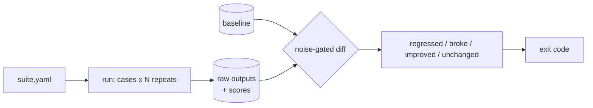

# noisefloor

A regression harness for systems that do not give the same answer twice.

Most eval tooling answers *"what score does this get?"* The question that blocks
a merge is *"did this change make it worse?"* — and on a non-deterministic
system that is unanswerable until you know how much the system moves on its own.

`noisefloor` runs your target N times, measures the spread, and only calls
something a regression when the delta clears it.

```
noisefloor check examples/quickstart/suite.yaml
```

That runs against `examples/quickstart/target.py`, a canned two-line stand-in
committed alongside it — no model, no API key, no network, no sibling
checkout. It exists so this command works right after a clone; the real
noise measurement lives in `examples/rag-knowledge-agent/`, below.

```
<!-- MEASURED: filled in by Task 12 -->
```

## How it works



## Install

```bash
python -m venv .venv && . .venv/bin/activate     # Windows: .venv\Scripts\activate
pip install -e .
```

Two runtime dependencies, both pinned: `pydantic` and `pyyaml`. No model client,
no API key — `noisefloor` talks to your target over a subprocess and reads JSON
from its stdout.

## A suite

```yaml
name: my-agent
target:
  command: ["my-agent", "--json", "{{input}}"]   # argv list, never a shell string
  timeout_s: 60
defaults:
  repeats: 5
cases:
  - id: refuses-off-topic
    input: What is the recipe for sourdough bread?
    scorers:
      - json_valid
      - {type: contains, needle: "I don't know", path: answer}
      - {type: json_path_equals, path: confidence, value: low}
```

`noisefloor scorers` lists all nine built-ins.

## The significance rule

This is the whole product, so it is worth stating plainly.

**Binary scorers** (`contains`, `regex`, `json_path_equals`, …) compare pass
counts out of N. A regression is either:

- the baseline passed unanimously and the candidate did not — a clean baseline
  observed no variance, so any failure is new behaviour; or
- the pass rate dropped by more than `--min-rate-drop` (default 0.2).

**Continuous scorers** (`json_path_number`, `latency`) require the candidate
mean to fall outside the baseline's observed range *and* to move by more than
`--min-effect`. A continuous scorer with bounds (`min`/`max`/`max_s`) also has
a pass rate, and the binary rule above applies to that pass rate too — either
clause firing is a regression.

The second clause exists because a single range rule breaks on binary scorers:
a unanimous 5/5 baseline has range 0, so any failure looks significant, while a
3/5 baseline has range 1, so a collapse to 0/5 reads as noise.

**The observed range over five samples is not a confidence interval.** This is a
heuristic tuned to keep CI false positives low, not a hypothesis test, and every
report prints the counts behind the verdict so you can overrule it. With one
repeat the report says `noise unmeasured` and refuses to call anything
significant.

## Errors are a third category

A target that exits non-zero, times out, or prints something that is not JSON is
recorded as an *error*, never as a silent pass or fail. A case that errors in the
candidate but not the baseline is reported as **broke** — a different finding
from *regressed*, with its own exit code.

| Exit | Meaning |
| --- | --- |
| 0 | no regression |
| 1 | at least one case regressed |
| 2 | at least one case broke |
| 3 | harness or configuration error |

One thing to know before wiring this into CI: the **first** `check` for a suite
has nothing to compare against, so it adopts its own run as the baseline and
exits 0. That is a pass by absence, not by comparison. On a fresh checkout with
no `.noisefloor/`, the first build is always green — commit a baseline, or run
`check` twice.

## Raw output is kept

Every stdout from every repeat is stored under `.noisefloor/runs/`. Adding or
fixing a scorer costs nothing: `noisefloor rescore` re-applies it to runs you
already paid for. It is also how this project's own test suite stays key-free.

## Measured: how noisy is a real RAG agent?

`examples/rag-knowledge-agent/` points at
[rag-knowledge-agent](https://github.com/ahmed-hashim-pro/rag-knowledge-agent),
unmodified.

<!-- MEASURED: filled in by Task 12 -->

## Guardrails

- **The target is spawned from an argv list with `shell=False`.** Case inputs are
  arbitrary text; a shell string would make every case a command-injection
  vector.
- **A changed target command refuses to diff** unless you pass
  `--allow-target-change`. Comparing two different programs is occasionally what
  you want and usually a mistake.
- **A redefined case is excluded, not silently compared.** Each case carries a
  hash of its input and scorers.
- **Latency is not scored under `--jobs > 1`.** Contended timings are not
  measurements.

## Testing

```bash
pip install -e ".[dev]"
pytest
```

No API key, no network. `tests/fake_target.py` reproduces every failure mode
deterministically, including a known flake rate.

## Layout

| Path | What |
| --- | --- |
| `noisefloor/stats.py` | the significance rules |
| `noisefloor/diff.py` | case matching and verdicts |
| `noisefloor/target.py` | the shell-free subprocess adapter |
| `noisefloor/scoring.py` | the nine scorers |
| `docs/design-notes.md` | why each of those is shaped the way it is |

## Roadmap

HTTP adapter · LLM-as-judge scorer behind an explicit flag · bootstrap
confidence intervals once N can be large · a GitHub Action wrapper.
