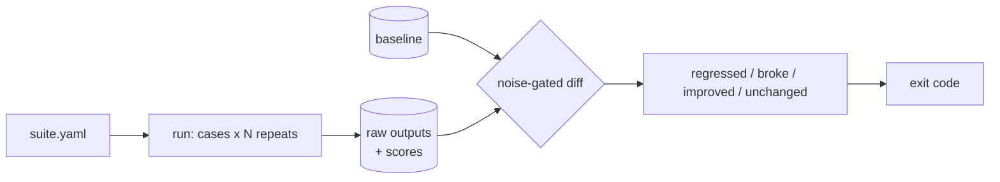

# noisefloor Implementation Plan

> **For agentic workers:** REQUIRED SUB-SKILL: Use superpowers:subagent-driven-development (recommended) or superpowers:executing-plans to implement this plan task-by-task. Steps use checkbox (`- [ ]`) syntax for tracking.

**Goal:** Build a CLI harness that measures the run-to-run noise of a non-deterministic target before deciding whether a change is a regression.

**Architecture:** A YAML suite names an argv-list target command and a list of cases with deterministic scorers. Each case runs N times; every raw stdout is persisted so scorers can be re-applied offline. A diff compares a candidate run against a saved baseline using two significance rules — pass-rate comparison for binary scorers, range-plus-effect-size for continuous ones — and sets the process exit code.

**Tech Stack:** Python 3.11+, pydantic v2, PyYAML, pytest, ruff. No network, no API key, no model calls anywhere in the harness or its tests.

**Spec:** `docs/superpowers/specs/2026-09-02-noisefloor-design.md`

## Global Constraints

- Python ≥ 3.11. Runtime dependencies are exactly `pydantic` and `pyyaml`, both pinned. Dev dependencies are exactly `pytest` and `ruff`, both pinned.
- The entry point is `noisefloor`.
- The harness never calls a model and never reads `ANTHROPIC_API_KEY`. The full test suite passes with no network and no keys. Task 12 is the single exception and is explicitly gated.
- Type hints on every public function. `ruff check .` and `ruff format --check .` must pass before every commit.
- The target subprocess is spawned from an argv list with `shell=False`. There is no code path anywhere that builds a shell string from case input.
- Reports go to stdout; diagnostics and warnings go to stderr.
- Exit codes: `0` no regression, `1` regression, `2` broke, `3` harness or configuration error. `broke` outranks `regressed`.
- Defaults: `repeats=5`, `timeout_s=60.0`, `min_rate_drop=0.2`, `min_effect=0.0`, storage root `.noisefloor/`.
- Anything committed uses repo-relative paths only. No absolute paths, no usernames.
- Nothing is pushed to any remote. The repo stays local until that is a separate, explicit decision.

---

## File Structure

| File | Responsibility |
|---|---|
| `pyproject.toml` | Pinned deps, entry point, ruff and pytest config |
| `noisefloor/__init__.py` | `__version__` only |
| `noisefloor/config.py` | Defaults and the `Paths` layout helper |
| `noisefloor/jsonpath.py` | The minimal path subset — parse and extract |
| `noisefloor/suite.py` | `Suite`/`Case`/`TargetSpec`/`ScorerSpec`, YAML loading, hashes |
| `noisefloor/target.py` | argv templating, subprocess invocation, outcome classification |
| `noisefloor/scoring.py` | `ScoreResult`, scorer registry, the nine built-ins |
| `noisefloor/stats.py` | Aggregation and the two significance rules (pure functions) |
| `noisefloor/run.py` | Orchestration, `RunRecord` persistence, rescore |
| `noisefloor/diff.py` | Case matching and verdicts |
| `noisefloor/report.py` | Terminal, JSON, and markdown rendering |
| `noisefloor/cli.py` | Subcommands and exit codes |
| `tests/fake_target.py` | Deterministic stand-in target: flaky, slow, broken, garbage |
| `tests/fixtures/` | Committed `RunRecord` JSON for diff and report tests |
| `examples/rag-knowledge-agent/` | First real suite plus a committed baseline |
| `README.md`, `docs/design-notes.md` | Documentation with captured output |

---

## Task 1: Project skeleton and config

**Files:**
- Create: `pyproject.toml`, `noisefloor/__init__.py`, `noisefloor/config.py`
- Test: `tests/test_config.py`

**Interfaces:**
- Consumes: nothing.
- Produces: `noisefloor.__version__: str`; `config.DEFAULT_REPEATS: int`, `config.DEFAULT_TIMEOUT_S: float`, `config.DEFAULT_MIN_RATE_DROP: float`, `config.DEFAULT_MIN_EFFECT: float`, `config.DEFAULT_ROOT: Path`; `config.Paths(root: Path)` with `.runs -> Path`, `.baselines -> Path`, `.run_dir(run_id: str) -> Path`, `.case_dir(run_id: str, case_id: str) -> Path`, `.baseline_file(suite_name: str) -> Path`, `.ensure() -> None`.

- [ ] **Step 1: Write `pyproject.toml`**

```toml
[build-system]
requires = ["setuptools>=69"]
build-backend = "setuptools.build_meta"

[project]
name = "noisefloor"
version = "0.1.0"
description = "A regression harness that measures noise before it calls anything a regression"
requires-python = ">=3.11"
dependencies = [
    "pydantic==2.9.2",
    "pyyaml==6.0.2",
]

[project.optional-dependencies]
dev = [
    "pytest==8.3.3",
    "ruff==0.6.9",
]

[project.scripts]
noisefloor = "noisefloor.cli:main"

[tool.setuptools.packages.find]
include = ["noisefloor*"]

[tool.pytest.ini_options]
testpaths = ["tests"]

[tool.ruff]
line-length = 88
target-version = "py311"

[tool.ruff.lint]
select = ["E", "F", "I", "UP", "B", "SIM"]
```

- [ ] **Step 2: Write the failing test**

Create `tests/test_config.py`:

```python
from pathlib import Path

from noisefloor.config import DEFAULT_REPEATS, Paths


def test_defaults_match_the_spec() -> None:
    assert DEFAULT_REPEATS == 5


def test_paths_are_derived_from_one_root(tmp_path: Path) -> None:
    paths = Paths(tmp_path / ".noisefloor")
    assert paths.run_dir("r1") == tmp_path / ".noisefloor" / "runs" / "r1"
    assert paths.case_dir("r1", "c1") == paths.run_dir("r1") / "cases" / "c1"
    assert paths.baseline_file("s") == tmp_path / ".noisefloor" / "baselines" / "s.json"


def test_ensure_creates_the_tree(tmp_path: Path) -> None:
    paths = Paths(tmp_path / ".noisefloor")
    paths.ensure()
    assert paths.runs.is_dir()
    assert paths.baselines.is_dir()
```

- [ ] **Step 3: Run test to verify it fails**

Run: `python -m pytest tests/test_config.py -v`
Expected: FAIL with `ModuleNotFoundError: No module named 'noisefloor'`

- [ ] **Step 4: Write the implementation**

Create `noisefloor/__init__.py`:

```python
__version__ = "0.1.0"
```

Create `noisefloor/config.py`:

```python
"""Defaults and the on-disk layout. Every tunable in the harness lives here."""

from __future__ import annotations

from dataclasses import dataclass
from pathlib import Path

DEFAULT_REPEATS = 5
DEFAULT_TIMEOUT_S = 60.0

#: A binary scorer regresses when the pass rate drops by more than this. At the
#: default N=5 that means one extra failure is tolerated from an already-flaky
#: baseline, but two are not. See the spec, section 6.3.
DEFAULT_MIN_RATE_DROP = 0.2

#: Continuous scorers must also move by more than this to count. Zero means only
#: the observed-range clause binds, which is the right default until you know
#: what size of change you care about.
DEFAULT_MIN_EFFECT = 0.0

DEFAULT_ROOT = Path(".noisefloor")


@dataclass(frozen=True)
class Paths:
    root: Path

    @property
    def runs(self) -> Path:
        return self.root / "runs"

    @property
    def baselines(self) -> Path:
        return self.root / "baselines"

    def run_dir(self, run_id: str) -> Path:
        return self.runs / run_id

    def case_dir(self, run_id: str, case_id: str) -> Path:
        return self.run_dir(run_id) / "cases" / case_id

    def baseline_file(self, suite_name: str) -> Path:
        return self.baselines / f"{suite_name}.json"

    def ensure(self) -> None:
        self.runs.mkdir(parents=True, exist_ok=True)
        self.baselines.mkdir(parents=True, exist_ok=True)
```

- [ ] **Step 5: Install and run the tests**

Run:
```bash
python -m venv .venv && . .venv/bin/activate
pip install -e ".[dev]"
python -m pytest tests/test_config.py -v
ruff check . && ruff format --check .
```
Expected: 3 passed, ruff clean.

- [ ] **Step 6: Commit**

```bash
git add pyproject.toml noisefloor/ tests/
git commit -m "Add project skeleton and configuration defaults"
```

---

## Task 2: The JSON path subset

**Files:**
- Create: `noisefloor/jsonpath.py`
- Test: `tests/test_jsonpath.py`

**Interfaces:**
- Consumes: nothing.
- Produces: `jsonpath.JsonPathError(ValueError)`; `jsonpath.JsonPath` with `.raw: str`, `.is_multi: bool`, `JsonPath.parse(raw: str) -> JsonPath`, `.extract(data: Any) -> list[Any]`.

`extract` always returns a list: zero or one element for a scalar path, N for a wildcard path, and an empty list when the path is absent. Callers decide what absence means.

- [ ] **Step 1: Write the failing test**

Create `tests/test_jsonpath.py`:

```python
import pytest

from noisefloor.jsonpath import JsonPath, JsonPathError

DOC = {
    "confidence": "high",
    "citations": [
        {"source": "a.md", "score": 0.7},
        {"source": "b.md", "score": 0.4},
    ],
}


def test_top_level_key() -> None:
    assert JsonPath.parse("confidence").extract(DOC) == ["high"]


def test_indexed_element() -> None:
    assert JsonPath.parse("citations[0].source").extract(DOC) == ["a.md"]


def test_wildcard_yields_every_element() -> None:
    assert JsonPath.parse("citations[].source").extract(DOC) == ["a.md", "b.md"]


def test_missing_key_is_empty_not_an_error() -> None:
    assert JsonPath.parse("nope").extract(DOC) == []
    assert JsonPath.parse("citations[].nope").extract(DOC) == []


def test_index_out_of_range_is_empty() -> None:
    assert JsonPath.parse("citations[9].source").extract(DOC) == []


def test_indexing_a_non_list_is_empty() -> None:
    assert JsonPath.parse("confidence[0]").extract(DOC) == []


def test_is_multi_flags_wildcards() -> None:
    assert JsonPath.parse("citations[].source").is_multi
    assert not JsonPath.parse("citations[0].source").is_multi


@pytest.mark.parametrize("raw", ["", "a..b", "a[", "a[x]", "a[-1]", "[0]", "a.", ".a"])
def test_malformed_paths_are_rejected_at_parse_time(raw: str) -> None:
    """Suite authors get the error at load time, not mid-run."""
    with pytest.raises(JsonPathError):
        JsonPath.parse(raw)
```

- [ ] **Step 2: Run test to verify it fails**

Run: `python -m pytest tests/test_jsonpath.py -v`
Expected: FAIL with `ModuleNotFoundError: No module named 'noisefloor.jsonpath'`

- [ ] **Step 3: Write the implementation**

Create `noisefloor/jsonpath.py`:

```python
"""A deliberately tiny path subset: dotted keys, `[i]`, and `[]`.

Anything richer would be a second query language to learn, test, and document.
Paths are parsed when a suite loads, so a typo is a validation error rather than
a silent empty result halfway through a run.
"""

from __future__ import annotations

import re
from dataclasses import dataclass
from typing import Any

_SEGMENT = re.compile(r"^([A-Za-z_][A-Za-z0-9_-]*)((?:\[\d*\])*)$")
_SUBSCRIPT = re.compile(r"\[(\d*)\]")


class JsonPathError(ValueError):
    """A path that cannot be parsed."""


@dataclass(frozen=True)
class _Key:
    name: str


@dataclass(frozen=True)
class _Index:
    position: int


@dataclass(frozen=True)
class _Wildcard:
    pass


_Segment = _Key | _Index | _Wildcard


@dataclass(frozen=True)
class JsonPath:
    raw: str
    segments: tuple[_Segment, ...]

    @classmethod
    def parse(cls, raw: str) -> JsonPath:
        if not raw or not raw.strip():
            raise JsonPathError("path is empty")
        segments: list[_Segment] = []
        for part in raw.split("."):
            match = _SEGMENT.match(part)
            if match is None:
                raise JsonPathError(f"{raw!r}: cannot parse segment {part!r}")
            segments.append(_Key(match.group(1)))
            for subscript in _SUBSCRIPT.findall(match.group(2)):
                segments.append(
                    _Wildcard() if subscript == "" else _Index(int(subscript))
                )
        return cls(raw=raw, segments=tuple(segments))

    @property
    def is_multi(self) -> bool:
        return any(isinstance(seg, _Wildcard) for seg in self.segments)

    def extract(self, data: Any) -> list[Any]:
        current: list[Any] = [data]
        for segment in self.segments:
            current = list(_step(current, segment))
        return current


def _step(values: list[Any], segment: _Segment):
    for value in values:
        match segment:
            case _Key(name):
                if isinstance(value, dict) and name in value:
                    yield value[name]
            case _Index(position):
                if isinstance(value, list) and position < len(value):
                    yield value[position]
            case _Wildcard():
                if isinstance(value, list):
                    yield from value
```

- [ ] **Step 4: Run the tests**

Run: `python -m pytest tests/test_jsonpath.py -v && ruff check .`
Expected: all pass, ruff clean.

- [ ] **Step 5: Commit**

```bash
git add noisefloor/jsonpath.py tests/test_jsonpath.py
git commit -m "Add the minimal JSON path subset used by scorers"
```

---

## Task 3: Suite model and loading

**Files:**
- Create: `noisefloor/suite.py`
- Test: `tests/test_suite.py`

**Interfaces:**
- Consumes: `config.DEFAULT_REPEATS`, `config.DEFAULT_TIMEOUT_S`.
- Produces:
  - `suite.SuiteError(ValueError)`
  - `suite.ScorerSpec` — pydantic model, `type: str`, extra fields allowed, `.params() -> dict[str, Any]`
  - `suite.TargetSpec` — `command: list[str]`, `cwd: str | None`, `timeout_s: float`, `env: dict[str, str]`
  - `suite.Case` — `id: str`, `input: str`, `repeats: int | None`, `scorers: list[ScorerSpec]`, `.definition_hash() -> str`
  - `suite.Suite` — `name: str`, `target: TargetSpec`, `cases: list[Case]`, `default_repeats: int`, `.source_dir: Path`, `.suite_hash() -> str`, `.repeats_for(case: Case) -> int`, `.case_by_id: dict[str, Case]`
  - `suite.load_suite(path: Path) -> Suite`

Validation of individual scorer parameters is **not** done here — `scoring.validate_spec` owns it, and Task 5 wires it into `load_suite`. That keeps `suite.py` from needing to know every scorer.

- [ ] **Step 1: Write the failing test**

Create `tests/test_suite.py`:

```python
from pathlib import Path

import pytest

from noisefloor.suite import SuiteError, load_suite

SUITE = """
name: demo
target:
  command: ["echo", "{{input}}"]
  cwd: ../thing
  timeout_s: 12
defaults:
  repeats: 3
cases:
  - id: one
    input: |
      a multi-line
      question
    scorers:
      - json_valid
      - {type: contains, needle: hello}
  - id: two
    input: short
    repeats: 7
    scorers: [json_valid]
"""


def write(tmp_path: Path, text: str) -> Path:
    path = tmp_path / "suite.yaml"
    path.write_text(text, encoding="utf-8")
    return path


def test_loads_cases_and_target(tmp_path: Path) -> None:
    s = load_suite(write(tmp_path, SUITE))
    assert s.name == "demo"
    assert s.target.command == ["echo", "{{input}}"]
    assert s.target.timeout_s == 12
    assert [c.id for c in s.cases] == ["one", "two"]


def test_bare_string_scorer_is_normalised(tmp_path: Path) -> None:
    s = load_suite(write(tmp_path, SUITE))
    assert s.cases[0].scorers[0].type == "json_valid"
    assert s.cases[0].scorers[1].params() == {"needle": "hello"}


def test_repeats_fall_back_to_the_suite_default(tmp_path: Path) -> None:
    s = load_suite(write(tmp_path, SUITE))
    assert s.repeats_for(s.cases[0]) == 3
    assert s.repeats_for(s.cases[1]) == 7


def test_source_dir_anchors_relative_cwd(tmp_path: Path) -> None:
    """`cwd` in the suite is relative to the suite file, not the shell."""
    s = load_suite(write(tmp_path, SUITE))
    assert s.source_dir == tmp_path


def test_definition_hash_changes_with_input(tmp_path: Path) -> None:
    before = load_suite(write(tmp_path, SUITE)).cases[0].definition_hash()
    after = load_suite(write(tmp_path, SUITE.replace("short", "changed"))).cases[0]
    assert after.definition_hash() == before  # case "one" is untouched


def test_definition_hash_is_per_case(tmp_path: Path) -> None:
    original = load_suite(write(tmp_path, SUITE))
    edited = load_suite(write(tmp_path, SUITE.replace("short", "changed")))
    assert edited.cases[1].definition_hash() != original.cases[1].definition_hash()


def test_scorer_order_is_part_of_the_hash(tmp_path: Path) -> None:
    swapped = SUITE.replace(
        "      - json_valid\n      - {type: contains, needle: hello}",
        "      - {type: contains, needle: hello}\n      - json_valid",
    )
    original = load_suite(write(tmp_path, SUITE)).cases[0].definition_hash()
    assert load_suite(write(tmp_path, swapped)).cases[0].definition_hash() != original


def test_case_ids_must_be_filename_safe(tmp_path: Path) -> None:
    """Ids become directory names; a rewritten id would break case matching."""
    with pytest.raises(SuiteError):
        load_suite(write(tmp_path, SUITE.replace("id: two", "id: ../escape")))


def test_duplicate_case_ids_are_rejected(tmp_path: Path) -> None:
    bad = SUITE.replace("id: two", "id: one")
    with pytest.raises(SuiteError, match="duplicate case id"):
        load_suite(write(tmp_path, bad))


def test_empty_command_is_rejected(tmp_path: Path) -> None:
    bad = SUITE.replace('command: ["echo", "{{input}}"]', "command: []")
    with pytest.raises(SuiteError):
        load_suite(write(tmp_path, bad))


def test_missing_file_is_a_suite_error(tmp_path: Path) -> None:
    with pytest.raises(SuiteError, match="not found"):
        load_suite(tmp_path / "absent.yaml")


def test_malformed_yaml_is_a_suite_error(tmp_path: Path) -> None:
    with pytest.raises(SuiteError):
        load_suite(write(tmp_path, "name: [unclosed"))
```

- [ ] **Step 2: Run test to verify it fails**

Run: `python -m pytest tests/test_suite.py -v`
Expected: FAIL with `ModuleNotFoundError: No module named 'noisefloor.suite'`

- [ ] **Step 3: Write the implementation**

Create `noisefloor/suite.py`:

```python
"""Suite definition: what to run, on which inputs, scored how.

YAML rather than TOML because case inputs are prompts, and block scalars are the
only pleasant way to write a multi-line prompt in a config file.
"""

from __future__ import annotations

import hashlib
import json
from pathlib import Path
from typing import Any

import yaml
from pydantic import BaseModel, ConfigDict, Field, ValidationError

from noisefloor.config import DEFAULT_REPEATS, DEFAULT_TIMEOUT_S


class SuiteError(ValueError):
    """A suite file that cannot be loaded or does not make sense."""


class ScorerSpec(BaseModel):
    model_config = ConfigDict(extra="allow")

    type: str

    def params(self) -> dict[str, Any]:
        return dict(self.__pydantic_extra__ or {})

    def canonical(self) -> dict[str, Any]:
        return {"type": self.type, **self.params()}


class TargetSpec(BaseModel):
    model_config = ConfigDict(extra="forbid")

    command: list[str] = Field(min_length=1)
    cwd: str | None = None
    timeout_s: float = DEFAULT_TIMEOUT_S
    env: dict[str, str] = Field(default_factory=dict)


class Case(BaseModel):
    model_config = ConfigDict(extra="forbid")

    #: Case ids become directory names under `.noisefloor/runs/`, so they are
    #: constrained rather than sanitised — a silently rewritten id would break
    #: the matching that the whole diff depends on.
    id: str = Field(pattern=r"^[A-Za-z0-9][A-Za-z0-9._-]*$")
    input: str
    repeats: int | None = Field(default=None, ge=1)
    scorers: list[ScorerSpec] = Field(min_length=1)

    def definition_hash(self) -> str:
        """Identity of what this case *means*, so a silent edit cannot hide.

        Deliberately excludes ``repeats``: running a case more times sharpens the
        measurement without changing the thing being measured.
        """
        payload = json.dumps(
            {"input": self.input, "scorers": [s.canonical() for s in self.scorers]},
            sort_keys=True,
            ensure_ascii=False,
        )
        return hashlib.sha256(payload.encode("utf-8")).hexdigest()[:16]


class _Defaults(BaseModel):
    model_config = ConfigDict(extra="forbid")

    repeats: int = Field(default=DEFAULT_REPEATS, ge=1)


class _SuiteFile(BaseModel):
    model_config = ConfigDict(extra="forbid")

    name: str = Field(min_length=1)
    target: TargetSpec
    defaults: _Defaults = Field(default_factory=_Defaults)
    cases: list[Case] = Field(min_length=1)


class Suite:
    def __init__(self, model: _SuiteFile, source_path: Path) -> None:
        self.name = model.name
        self.target = model.target
        self.cases = model.cases
        self.default_repeats = model.defaults.repeats
        self.source_path = source_path
        self.source_dir = source_path.parent
        self.case_by_id = {case.id: case for case in model.cases}

    def repeats_for(self, case: Case) -> int:
        return case.repeats if case.repeats is not None else self.default_repeats

    def suite_hash(self) -> str:
        payload = json.dumps(
            {
                "name": self.name,
                "target": self.target.model_dump(),
                "cases": {c.id: c.definition_hash() for c in self.cases},
            },
            sort_keys=True,
            ensure_ascii=False,
        )
        return hashlib.sha256(payload.encode("utf-8")).hexdigest()[:16]

    @property
    def target_cwd(self) -> Path:
        """`cwd` is resolved against the suite file so a suite is portable."""
        if self.target.cwd is None:
            return self.source_dir
        return (self.source_dir / self.target.cwd).resolve()


def _normalise_scorers(raw: Any) -> Any:
    """`- json_valid` is sugar for `- {type: json_valid}`."""
    if not isinstance(raw, dict):
        return raw
    for case in raw.get("cases") or []:
        if not isinstance(case, dict):
            continue
        scorers = case.get("scorers")
        if isinstance(scorers, list):
            case["scorers"] = [
                {"type": s} if isinstance(s, str) else s for s in scorers
            ]
    return raw


def load_suite(path: Path) -> Suite:
    if not path.is_file():
        raise SuiteError(f"suite not found: {path}")
    try:
        raw = yaml.safe_load(path.read_text(encoding="utf-8"))
    except yaml.YAMLError as exc:
        raise SuiteError(f"{path}: invalid YAML: {exc}") from exc
    if not isinstance(raw, dict):
        raise SuiteError(f"{path}: expected a mapping at the top level")

    try:
        model = _SuiteFile.model_validate(_normalise_scorers(raw))
    except ValidationError as exc:
        raise SuiteError(f"{path}: {exc}") from exc

    seen: set[str] = set()
    for case in model.cases:
        if case.id in seen:
            raise SuiteError(f"{path}: duplicate case id {case.id!r}")
        seen.add(case.id)

    return Suite(model, path.resolve())
```

- [ ] **Step 4: Run the tests**

Run: `python -m pytest tests/test_suite.py -v && ruff check .`
Expected: all pass, ruff clean.

- [ ] **Step 5: Commit**

```bash
git add noisefloor/suite.py tests/test_suite.py
git commit -m "Add suite model, YAML loading, and per-case definition hashes"
```

---

## Task 4: Target adapter and the fake target

**Files:**
- Create: `noisefloor/target.py`, `tests/fake_target.py`
- Test: `tests/test_target.py`

**Interfaces:**
- Consumes: `suite.TargetSpec`, `suite.Case`.
- Produces:
  - `target.Invocation` — frozen dataclass with `case_id: str`, `repeat: int`, `argv: list[str]`, `stdout: str`, `stderr: str`, `exit_code: int | None`, `duration_s: float`, `outcome: str`, `parsed: Any | None`, and `.ok: bool`
  - `target.render_argv(command: list[str], *, case_id: str, case_input: str, repeat: int) -> list[str]`
  - `target.invoke(spec: TargetSpec, case: Case, repeat: int, *, cwd: Path) -> Invocation`
  - `target.OUTCOMES: tuple[str, ...]` = `("ok", "error:exit", "error:timeout", "error:parse")`

`tests/fake_target.py` is a standalone CLI used by every later task that needs a subprocess. Its contract:

```
python tests/fake_target.py --answer TEXT [--confidence C] [--exit-code N]
                            [--delay SECONDS] [--garbage] [--stderr TEXT]
                            [--flake-every N --repeat R]
```

It prints `{"answer": ..., "confidence": ..., "citations": [...]}` to stdout. With `--flake-every N --repeat R` it degrades deterministically whenever `R % N == 0`.

Paired with the `{{repeat}}` template variable, that is how tests construct a *known* pass rate: `--flake-every 2 --repeat {{repeat}}` over four repeats gives exactly `fail, pass, fail, pass`. Tasks 6 and 8 rest on being able to produce a specific pass rate on demand, so `{{repeat}}` is not optional sugar.

- [ ] **Step 1: Write the fake target**

Create `tests/fake_target.py`:

```python
#!/usr/bin/env python3
"""A deterministic stand-in for a real target.

Every failure mode the harness must handle is reachable from flags, so no test
needs a model, a network, or a random seed. Flakiness is a function of the
repeat index, which makes a "3 out of 5 pass" baseline exactly reproducible.
"""

from __future__ import annotations

import argparse
import json
import sys
import time


def main() -> int:
    parser = argparse.ArgumentParser()
    parser.add_argument("--answer", default="the robot parks after twelve minutes")
    parser.add_argument("--confidence", default="high")
    parser.add_argument("--source", default="a.md")
    parser.add_argument("--score", type=float, default=0.7)
    parser.add_argument("--exit-code", type=int, default=0)
    parser.add_argument("--delay", type=float, default=0.0)
    parser.add_argument("--garbage", action="store_true")
    parser.add_argument("--stderr", default="")
    parser.add_argument("--flake-every", type=int, default=0)
    parser.add_argument("--repeat", type=int, default=0)
    parser.add_argument("--echo-argv", action="store_true")
    parser.add_argument("question", nargs="?", default="")
    args = parser.parse_args()

    if args.delay:
        time.sleep(args.delay)
    if args.stderr:
        print(args.stderr, file=sys.stderr)

    if args.echo_argv:
        print(json.dumps({"argv": sys.argv[1:]}))
        return 0
    if args.garbage:
        print("not json at all <html>")
        return args.exit_code

    flaking = args.flake_every > 0 and args.repeat % args.flake_every == 0
    payload = {
        "answer": "unrelated filler" if flaking else args.answer,
        "confidence": "low" if flaking else args.confidence,
        "citations": [{"source": args.source, "score": args.score}],
        "question": args.question,
    }
    print(json.dumps(payload))
    return args.exit_code


if __name__ == "__main__":
    raise SystemExit(main())
```

- [ ] **Step 2: Write the failing test**

Create `tests/test_target.py`:

```python
import json
import sys
from pathlib import Path

from noisefloor.suite import Case, ScorerSpec, TargetSpec
from noisefloor.target import invoke, render_argv

FAKE = str(Path(__file__).parent / "fake_target.py")


def case(text: str = "hello", case_id: str = "c1") -> Case:
    return Case(id=case_id, input=text, scorers=[ScorerSpec(type="json_valid")])


def spec(*extra: str, timeout_s: float = 10.0) -> TargetSpec:
    return TargetSpec(
        command=[sys.executable, FAKE, *extra, "{{input}}"], timeout_s=timeout_s
    )


# -- templating ------------------------------------------------------------


def test_input_is_substituted_into_one_element() -> None:
    argv = render_argv(
        ["cmd", "--q={{input}}"], case_id="c", case_input="a b", repeat=0
    )
    assert argv == ["cmd", "--q=a b"]


def test_case_id_is_substituted() -> None:
    assert render_argv(["{{case_id}}"], case_id="c1", case_input="", repeat=0) == ["c1"]


def test_repeat_is_substituted() -> None:
    """Lets a target vary per repeat, which is how tests build a known rate."""
    assert render_argv(["{{repeat}}"], case_id="c", case_input="", repeat=3) == ["3"]


def test_shell_metacharacters_stay_inside_one_argument(tmp_path: Path) -> None:
    """A shell string here would make case input a command-injection vector."""
    nasty = '; rm -rf ~ && echo "pwned" `whoami` $(id)'
    argv = render_argv(["cmd", "{{input}}"], case_id="c", case_input=nasty, repeat=0)
    assert argv == ["cmd", nasty]


def test_no_shell_is_used_end_to_end(tmp_path: Path) -> None:
    nasty = "; touch /tmp/nf_should_not_exist"
    result = invoke(spec("--echo-argv"), case(nasty), 0, cwd=tmp_path)
    assert json.loads(result.stdout)["argv"][-1] == nasty


# -- outcomes --------------------------------------------------------------


def test_successful_run_is_ok_and_parsed(tmp_path: Path) -> None:
    result = invoke(spec(), case(), 0, cwd=tmp_path)
    assert result.outcome == "ok"
    assert result.ok
    assert result.parsed["confidence"] == "high"
    assert result.duration_s >= 0


def test_non_zero_exit_is_error_exit(tmp_path: Path) -> None:
    result = invoke(spec("--exit-code", "3"), case(), 0, cwd=tmp_path)
    assert result.outcome == "error:exit"
    assert result.exit_code == 3
    assert not result.ok


def test_unparseable_stdout_is_error_parse(tmp_path: Path) -> None:
    result = invoke(spec("--garbage"), case(), 0, cwd=tmp_path)
    assert result.outcome == "error:parse"
    assert result.parsed is None


def test_timeout_is_error_timeout(tmp_path: Path) -> None:
    result = invoke(spec("--delay", "5", timeout_s=0.3), case(), 0, cwd=tmp_path)
    assert result.outcome == "error:timeout"
    assert result.exit_code is None


def test_stderr_is_captured_separately(tmp_path: Path) -> None:
    result = invoke(spec("--stderr", "loading model"), case(), 0, cwd=tmp_path)
    assert "loading model" in result.stderr
    assert result.outcome == "ok"


def test_missing_executable_is_error_exit_not_a_crash(tmp_path: Path) -> None:
    result = invoke(
        TargetSpec(command=["definitely-not-a-real-binary-xyz"]), case(), 0,
        cwd=tmp_path,
    )
    assert result.outcome == "error:exit"
    assert "definitely-not-a-real-binary-xyz" in result.stderr
```

- [ ] **Step 3: Run test to verify it fails**

Run: `python -m pytest tests/test_target.py -v`
Expected: FAIL with `ModuleNotFoundError: No module named 'noisefloor.target'`

- [ ] **Step 4: Write the implementation**

Create `noisefloor/target.py`:

```python
"""Run the target as a subprocess and classify what came back.

The command is an argv list and the process is spawned with ``shell=False``.
That is a security property, not a style choice: case inputs are arbitrary text,
and a shell string would turn every case into a command-injection vector.
"""

from __future__ import annotations

import json
import subprocess
import time
from dataclasses import dataclass
from pathlib import Path
from typing import Any

from noisefloor.suite import Case, TargetSpec

OUTCOMES = ("ok", "error:exit", "error:timeout", "error:parse")


@dataclass(frozen=True)
class Invocation:
    case_id: str
    repeat: int
    argv: list[str]
    stdout: str
    stderr: str
    exit_code: int | None
    duration_s: float
    outcome: str
    parsed: Any | None = None

    @property
    def ok(self) -> bool:
        return self.outcome == "ok"


def render_argv(
    command: list[str], *, case_id: str, case_input: str, repeat: int
) -> list[str]:
    return [
        element.replace("{{input}}", case_input)
        .replace("{{case_id}}", case_id)
        .replace("{{repeat}}", str(repeat))
        for element in command
    ]


def invoke(spec: TargetSpec, case: Case, repeat: int, *, cwd: Path) -> Invocation:
    argv = render_argv(
        spec.command, case_id=case.id, case_input=case.input, repeat=repeat
    )
    started = time.monotonic()

    def finish(**kwargs: Any) -> Invocation:
        return Invocation(
            case_id=case.id,
            repeat=repeat,
            argv=argv,
            duration_s=time.monotonic() - started,
            **kwargs,
        )

    try:
        completed = subprocess.run(  # noqa: S603 - argv list, shell=False
            argv,
            cwd=cwd,
            env=_env(spec),
            capture_output=True,
            text=True,
            timeout=spec.timeout_s,
            shell=False,
            check=False,
        )
    except subprocess.TimeoutExpired as exc:
        return finish(
            stdout=_text(exc.stdout),
            stderr=_text(exc.stderr),
            exit_code=None,
            outcome="error:timeout",
        )
    except OSError as exc:
        return finish(stdout="", stderr=str(exc), exit_code=None, outcome="error:exit")

    if completed.returncode != 0:
        return finish(
            stdout=completed.stdout,
            stderr=completed.stderr,
            exit_code=completed.returncode,
            outcome="error:exit",
        )

    try:
        parsed = json.loads(completed.stdout)
    except json.JSONDecodeError:
        return finish(
            stdout=completed.stdout,
            stderr=completed.stderr,
            exit_code=0,
            outcome="error:parse",
        )

    return finish(
        stdout=completed.stdout,
        stderr=completed.stderr,
        exit_code=0,
        outcome="ok",
        parsed=parsed,
    )


def _env(spec: TargetSpec) -> dict[str, str] | None:
    if not spec.env:
        return None
    import os

    return {**os.environ, **spec.env}


def _text(value: str | bytes | None) -> str:
    if value is None:
        return ""
    return value.decode("utf-8", "replace") if isinstance(value, bytes) else value
```

- [ ] **Step 5: Run the tests**

Run: `python -m pytest tests/test_target.py -v && ruff check .`
Expected: all pass, ruff clean.

- [ ] **Step 6: Commit**

```bash
git add noisefloor/target.py tests/fake_target.py tests/test_target.py
git commit -m "Add the shell-free subprocess adapter and a deterministic fake target"
```

---

## Task 5: Scorers

**Files:**
- Create: `noisefloor/scoring.py`
- Test: `tests/test_scoring.py`

**Interfaces:**
- Consumes: `jsonpath.JsonPath`, `suite.ScorerSpec`, `suite.Case`, `suite.Suite`, `suite.SuiteError`, `target.Invocation`.
- Produces:
  - `scoring.ScoreResult` — frozen dataclass: `key: str`, `type: str`, `kind: Literal["binary","continuous"]`, `direction: Literal["higher_is_better","lower_is_better"]`, `value: float`, `passed: bool`, `reliable: bool`, `detail: str`
  - `scoring.BoundScorer` — `.key: str`, `.type: str`, `.score(inv: Invocation) -> ScoreResult`
  - `scoring.build(spec: ScorerSpec, index: int, *, concurrent: bool = False) -> BoundScorer`
  - `scoring.build_all(case: Case, *, concurrent: bool = False) -> list[BoundScorer]`
  - `scoring.score_invocation(scorers: list[BoundScorer], inv: Invocation) -> list[ScoreResult]`
  - `scoring.validate_suite(suite: Suite) -> None` — raises `SuiteError`
  - `scoring.describe() -> list[tuple[str, str, str]]` — `(type, kind, parameter summary)` for `noisefloor scorers`

Scorer keys are `f"{index}:{type}"`. Index-based keys mean reordering a case's scorers changes the keys — which is correct, because reordering also changes the case definition hash, so the case is reported as `redefined` rather than silently mis-compared.

Text scorers (`contains`, `not_contains`, `regex`) read raw stdout by default, or the concatenation of a `path`'s string values when `path` is given.

- [ ] **Step 1: Write the failing test**

Create `tests/test_scoring.py`:

```python
import pytest

from noisefloor.scoring import build, build_all, score_invocation, validate_suite
from noisefloor.suite import Case, ScorerSpec, Suite, SuiteError, load_suite
from noisefloor.target import Invocation

PAYLOAD = {
    "answer": "The robot safe-parks after twelve minutes offline.",
    "confidence": "high",
    "citations": [
        {"source": "a.md", "score": 0.7},
        {"source": "b.md", "score": 0.4},
    ],
}


def inv(parsed=PAYLOAD, *, outcome="ok", duration=1.5) -> Invocation:
    import json

    return Invocation(
        case_id="c",
        repeat=0,
        argv=["x"],
        stdout=json.dumps(parsed) if parsed is not None else "boom",
        stderr="",
        exit_code=0,
        duration_s=duration,
        outcome=outcome,
        parsed=parsed,
    )


def score(type_: str, **params):
    return build(ScorerSpec(type=type_, **params), 0).score(inv())


# -- binary scorers --------------------------------------------------------


def test_json_valid_passes_on_parsed_output() -> None:
    assert score("json_valid").passed


def test_contains_is_case_insensitive_by_default() -> None:
    assert score("contains", needle="SAFE-PARKS").passed


def test_contains_honours_case_sensitive() -> None:
    assert not score("contains", needle="SAFE-PARKS", case_sensitive=True).passed


def test_contains_can_target_a_path() -> None:
    assert score("contains", needle="twelve", path="answer").passed
    assert not score("contains", needle="twelve", path="confidence").passed


def test_not_contains_inverts() -> None:
    assert score("not_contains", needle="parental leave").passed
    assert not score("not_contains", needle="twelve").passed


def test_regex_matches() -> None:
    assert score("regex", pattern=r"twelve\s+minutes").passed


def test_json_path_equals() -> None:
    assert score("json_path_equals", path="confidence", value="high").passed
    assert not score("json_path_equals", path="confidence", value="low").passed


def test_json_path_equals_fails_when_path_is_absent() -> None:
    assert not score("json_path_equals", path="missing", value="high").passed


def test_json_path_in() -> None:
    assert score("json_path_in", path="confidence", values=["high", "medium"]).passed
    assert not score("json_path_in", path="confidence", values=["low"]).passed


def test_json_path_subset() -> None:
    ok = score("json_path_subset", path="citations[].source", allowed=["a.md", "b.md"])
    bad = score("json_path_subset", path="citations[].source", allowed=["a.md"])
    assert ok.passed and not bad.passed


def test_json_path_subset_of_nothing_passes() -> None:
    """An empty set is a subset of everything; a refusal cites nothing."""
    empty = build(
        ScorerSpec(type="json_path_subset", path="citations[].source", allowed=["z"]),
        0,
    ).score(inv({"citations": []}))
    assert empty.passed


def test_binary_results_are_zero_or_one() -> None:
    assert score("json_valid").value == 1.0
    assert score("contains", needle="nope").value == 0.0


# -- continuous scorers ----------------------------------------------------


def test_json_path_number_takes_the_worst_value_by_default() -> None:
    result = score("json_path_number", path="citations[].score", min=0.5)
    assert result.kind == "continuous"
    assert result.value == pytest.approx(0.4)
    assert not result.passed


def test_json_path_number_aggregate_mean() -> None:
    result = score("json_path_number", path="citations[].score", aggregate="mean")
    assert result.value == pytest.approx(0.55)


def test_latency_is_lower_is_better() -> None:
    result = score("latency", max_s=1.0)
    assert result.direction == "lower_is_better"
    assert result.value == pytest.approx(1.5)
    assert not result.passed


def test_latency_is_unreliable_under_concurrency() -> None:
    """Contended timings are not measurements, and must not be treated as such."""
    concurrent = build(ScorerSpec(type="latency"), 0, concurrent=True).score(inv())
    serial = build(ScorerSpec(type="latency"), 0, concurrent=False).score(inv())
    assert not concurrent.reliable
    assert serial.reliable


def test_only_latency_is_affected_by_concurrency() -> None:
    result = build(ScorerSpec(type="json_valid"), 0, concurrent=True).score(inv())
    assert result.reliable


# -- errors are not scored -------------------------------------------------


def test_errored_invocations_produce_no_scores() -> None:
    scorers = build_all(
        Case(id="c", input="", scorers=[ScorerSpec(type="json_valid")])
    )
    assert score_invocation(scorers, inv(None, outcome="error:parse")) == []


# -- validation ------------------------------------------------------------


def test_unknown_scorer_type_is_rejected() -> None:
    with pytest.raises(SuiteError, match="unknown scorer"):
        build(ScorerSpec(type="vibes"), 0)


def test_missing_required_parameter_is_rejected() -> None:
    with pytest.raises(SuiteError, match="contains"):
        build(ScorerSpec(type="contains"), 0)


def test_unexpected_parameter_is_rejected() -> None:
    with pytest.raises(SuiteError):
        build(ScorerSpec(type="json_valid", nedle="typo"), 0)


def test_malformed_path_is_rejected_at_build_time() -> None:
    with pytest.raises(SuiteError):
        build(ScorerSpec(type="json_path_equals", path="a..b", value=1), 0)


def test_validate_suite_reports_the_offending_case(tmp_path) -> None:
    path = tmp_path / "s.yaml"
    path.write_text(
        'name: s\ntarget: {command: ["true"]}\n'
        "cases:\n  - id: bad\n    input: x\n    scorers: [{type: vibes}]\n",
        encoding="utf-8",
    )
    with pytest.raises(SuiteError, match="bad"):
        validate_suite(load_suite(path))


def test_keys_are_index_prefixed() -> None:
    case = Case(
        id="c",
        input="",
        scorers=[ScorerSpec(type="json_valid"), ScorerSpec(type="json_valid")],
    )
    assert [s.key for s in build_all(case)] == ["0:json_valid", "1:json_valid"]
```

- [ ] **Step 2: Run test to verify it fails**

Run: `python -m pytest tests/test_scoring.py -v`
Expected: FAIL with `ModuleNotFoundError: No module named 'noisefloor.scoring'`

- [ ] **Step 3: Pre-flight the mixin before writing nine scorers on top of it**

Five scorers inherit from two pydantic models at once
(`class JsonPathEquals(_Scorer, _PathMixin)`). Pydantic v2 supports this, but if
it does not work here it fails at *import*, so every scoring test errors at once
and tells you nothing about which construct broke. Write `_Scorer`, `_PathMixin`,
and `JsonPathEquals` only, then:

```bash
python -c "from noisefloor.scoring import JsonPathEquals; print(JsonPathEquals(path='a', value=1))"
```

If that errors, abandon the mixin: move `path: str | None` and
`extract_values()` onto `_Scorer` itself and delete `_PathMixin`. The rest of
the module is unchanged either way.

- [ ] **Step 4: Write the implementation**

Create `noisefloor/scoring.py`:

```python
"""Deterministic scorers. No model calls, so the harness never needs a key.

Every scorer emits the same shape — a float value and a boolean pass — because
the significance rules in :mod:`noisefloor.stats` need both: the pass rate
carries binary scorers, the value carries continuous ones.
"""

from __future__ import annotations

import re
import statistics
from dataclasses import dataclass
from typing import Any, ClassVar, Literal

from pydantic import BaseModel, ConfigDict, ValidationError, field_validator

from noisefloor.jsonpath import JsonPath, JsonPathError
from noisefloor.suite import Case, ScorerSpec, Suite, SuiteError
from noisefloor.target import Invocation

ScorerKind = Literal["binary", "continuous"]
Direction = Literal["higher_is_better", "lower_is_better"]


@dataclass(frozen=True)
class ScoreResult:
    key: str
    type: str
    kind: ScorerKind
    direction: Direction
    value: float
    passed: bool
    reliable: bool = True
    detail: str = ""


class _Scorer(BaseModel):
    model_config = ConfigDict(extra="forbid")

    KIND: ClassVar[ScorerKind] = "binary"
    DIRECTION: ClassVar[Direction] = "higher_is_better"
    SUMMARY: ClassVar[str] = ""

    def evaluate(self, inv: Invocation) -> tuple[float, bool, str]:
        raise NotImplementedError

    def reliable_under_concurrency(self) -> bool:
        return True


REGISTRY: dict[str, type[_Scorer]] = {}


def _register(name: str):
    def wrap(cls: type[_Scorer]) -> type[_Scorer]:
        REGISTRY[name] = cls
        return cls

    return wrap


def _binary(passed: bool, detail: str = "") -> tuple[float, bool, str]:
    return (1.0 if passed else 0.0, passed, detail)


class _PathMixin(BaseModel):
    path: str

    @field_validator("path")
    @classmethod
    def _parse(cls, value: str) -> str:
        JsonPath.parse(value)  # raises JsonPathError, surfaced as SuiteError
        return value

    def extract_values(self, inv: Invocation) -> list[Any]:
        return JsonPath.parse(self.path).extract(inv.parsed)


# -- binary ----------------------------------------------------------------


@_register("json_valid")
class JsonValid(_Scorer):
    SUMMARY: ClassVar[str] = "(no parameters) stdout parsed as JSON"

    def evaluate(self, inv: Invocation) -> tuple[float, bool, str]:
        return _binary(inv.parsed is not None)


class _TextScorer(_Scorer):
    path: str | None = None
    case_sensitive: bool = False

    @field_validator("path")
    @classmethod
    def _parse(cls, value: str | None) -> str | None:
        if value is not None:
            JsonPath.parse(value)
        return value

    def haystack(self, inv: Invocation) -> str:
        if self.path is None:
            text = inv.stdout
        else:
            found = JsonPath.parse(self.path).extract(inv.parsed)
            text = "\n".join(str(v) for v in found)
        return text if self.case_sensitive else text.lower()


@_register("contains")
class Contains(_TextScorer):
    needle: str
    SUMMARY: ClassVar[str] = "needle, [path], [case_sensitive]"

    def evaluate(self, inv: Invocation) -> tuple[float, bool, str]:
        needle = self.needle if self.case_sensitive else self.needle.lower()
        return _binary(needle in self.haystack(inv), f"needle={self.needle!r}")


@_register("not_contains")
class NotContains(Contains):
    SUMMARY: ClassVar[str] = "needle, [path], [case_sensitive]"

    def evaluate(self, inv: Invocation) -> tuple[float, bool, str]:
        value, passed, detail = super().evaluate(inv)
        return _binary(not passed, detail)


@_register("regex")
class Regex(_TextScorer):
    pattern: str
    SUMMARY: ClassVar[str] = "pattern, [path], [case_sensitive]"

    @field_validator("pattern")
    @classmethod
    def _compile(cls, value: str) -> str:
        re.compile(value)
        return value

    def evaluate(self, inv: Invocation) -> tuple[float, bool, str]:
        flags = 0 if self.case_sensitive else re.IGNORECASE
        found = re.search(self.pattern, self.haystack(inv), flags) is not None
        return _binary(found, f"pattern={self.pattern!r}")


@_register("json_path_equals")
class JsonPathEquals(_Scorer, _PathMixin):
    value: Any
    SUMMARY: ClassVar[str] = "path, value"

    def evaluate(self, inv: Invocation) -> tuple[float, bool, str]:
        found = self.extract_values(inv)
        return _binary(found == [self.value], f"{self.path}={found!r}")


@_register("json_path_in")
class JsonPathIn(_Scorer, _PathMixin):
    values: list[Any]
    SUMMARY: ClassVar[str] = "path, values"

    def evaluate(self, inv: Invocation) -> tuple[float, bool, str]:
        found = self.extract_values(inv)
        ok = len(found) == 1 and found[0] in self.values
        return _binary(ok, f"{self.path}={found!r}")


@_register("json_path_subset")
class JsonPathSubset(_Scorer, _PathMixin):
    allowed: list[Any]
    SUMMARY: ClassVar[str] = "path, allowed"

    def evaluate(self, inv: Invocation) -> tuple[float, bool, str]:
        found = self.extract_values(inv)
        extra = [v for v in found if v not in self.allowed]
        return _binary(not extra, f"unexpected={extra!r}" if extra else "")


# -- continuous ------------------------------------------------------------


@_register("json_path_number")
class JsonPathNumber(_Scorer, _PathMixin):
    KIND: ClassVar[ScorerKind] = "continuous"
    SUMMARY: ClassVar[str] = "path, [min], [max], [aggregate=min], [direction]"

    min: float | None = None
    max: float | None = None
    aggregate: Literal["min", "max", "mean"] = "min"
    direction: Direction = "higher_is_better"

    def evaluate(self, inv: Invocation) -> tuple[float, bool, str]:
        numbers = [
            float(v) for v in self.extract_values(inv) if isinstance(v, int | float)
        ]
        if not numbers:
            return (0.0, False, f"{self.path}: no numeric value")
        value = {
            "min": min,
            "max": max,
            "mean": statistics.fmean,
        }[self.aggregate](numbers)
        passed = (self.min is None or value >= self.min) and (
            self.max is None or value <= self.max
        )
        return (float(value), passed, f"{self.path}={value:.4f}")


@_register("latency")
class Latency(_Scorer):
    KIND: ClassVar[ScorerKind] = "continuous"
    DIRECTION: ClassVar[Direction] = "lower_is_better"
    SUMMARY: ClassVar[str] = "[max_s]"

    max_s: float | None = None

    def evaluate(self, inv: Invocation) -> tuple[float, bool, str]:
        passed = self.max_s is None or inv.duration_s <= self.max_s
        return (inv.duration_s, passed, f"{inv.duration_s:.2f}s")

    def reliable_under_concurrency(self) -> bool:
        return False


# -- binding ---------------------------------------------------------------


@dataclass(frozen=True)
class BoundScorer:
    key: str
    type: str
    scorer: _Scorer
    reliable: bool

    def score(self, inv: Invocation) -> ScoreResult:
        value, passed, detail = self.scorer.evaluate(inv)
        direction = getattr(self.scorer, "direction", self.scorer.DIRECTION)
        return ScoreResult(
            key=self.key,
            type=self.type,
            kind=self.scorer.KIND,
            direction=direction,
            value=value,
            passed=passed,
            reliable=self.reliable,
            detail=detail,
        )


def build(spec: ScorerSpec, index: int, *, concurrent: bool = False) -> BoundScorer:
    cls = REGISTRY.get(spec.type)
    if cls is None:
        known = ", ".join(sorted(REGISTRY))
        raise SuiteError(f"unknown scorer {spec.type!r}. known scorers: {known}")
    try:
        scorer = cls(**spec.params())
    except (ValidationError, JsonPathError, re.error) as exc:
        raise SuiteError(f"scorer {spec.type!r}: {exc}") from exc
    reliable = scorer.reliable_under_concurrency() or not concurrent
    return BoundScorer(
        key=f"{index}:{spec.type}", type=spec.type, scorer=scorer, reliable=reliable
    )


def build_all(case: Case, *, concurrent: bool = False) -> list[BoundScorer]:
    return [
        build(spec, i, concurrent=concurrent) for i, spec in enumerate(case.scorers)
    ]


def score_invocation(
    scorers: list[BoundScorer], inv: Invocation
) -> list[ScoreResult]:
    """Errors are a third category — never a silent pass or fail."""
    if not inv.ok:
        return []
    return [s.score(inv) for s in scorers]


def validate_suite(suite: Suite) -> None:
    for case in suite.cases:
        try:
            build_all(case)
        except SuiteError as exc:
            raise SuiteError(f"case {case.id!r}: {exc}") from exc


def describe() -> list[tuple[str, str, str]]:
    return sorted(
        (name, cls.KIND, cls.SUMMARY) for name, cls in REGISTRY.items()
    )
```

- [ ] **Step 5: Run the tests**

Run: `python -m pytest tests/test_scoring.py -v && ruff check .`
Expected: all pass, ruff clean.

- [ ] **Step 6: Commit**

```bash
git add noisefloor/scoring.py tests/test_scoring.py
git commit -m "Add the nine deterministic scorers and suite validation"
```

---

## Task 6: Aggregation and the significance rules

**Files:**
- Create: `noisefloor/stats.py`
- Test: `tests/test_stats.py`

**Interfaces:**
- Consumes: `scoring.ScoreResult`, `config.DEFAULT_MIN_RATE_DROP`, `config.DEFAULT_MIN_EFFECT`.
- Produces:
  - `stats.ScorerAggregate` — frozen: `key`, `type`, `kind`, `direction`, `n: int`, `pass_count: int`, `values: tuple[float, ...]`, `reliable: bool`, and properties `pass_rate: float`, `mean: float`, `vmin: float`, `vmax: float`, `band: str`
  - `stats.aggregate_case(per_repeat: list[list[ScoreResult]]) -> dict[str, ScorerAggregate]`
  - `stats.Significance` — frozen: `key: str`, `verdict: Literal["regressed","improved","unchanged","unmeasured","skipped"]`, `reason: str`
  - `stats.compare(baseline: ScorerAggregate, candidate: ScorerAggregate, *, min_rate_drop: float = ..., min_effect: float = ...) -> Significance`

This is the module the whole project rests on. It is pure functions over numbers so it can be tested exhaustively with no I/O.

- [ ] **Step 1: Write the failing test**

Create `tests/test_stats.py`:

```python
from dataclasses import replace

import pytest

from noisefloor.scoring import ScoreResult
from noisefloor.stats import aggregate_case, compare


def binary(passed: bool, key: str = "0:contains") -> ScoreResult:
    return ScoreResult(
        key=key,
        type="contains",
        kind="binary",
        direction="higher_is_better",
        value=1.0 if passed else 0.0,
        passed=passed,
    )


def continuous(value: float, *, direction="higher_is_better", passed=True, key="0:n"):
    return ScoreResult(
        key=key,
        type="json_path_number",
        kind="continuous",
        direction=direction,
        value=value,
        passed=passed,
    )


def agg_binary(passes: int, n: int):
    return aggregate_case([[binary(i < passes)] for i in range(n)])["0:contains"]


def agg_continuous(values, **kw):
    return aggregate_case([[continuous(v, **kw)] for v in values])["0:n"]


# -- aggregation -----------------------------------------------------------


def test_aggregate_counts_passes_and_collects_values() -> None:
    a = agg_binary(3, 5)
    assert (a.n, a.pass_count) == (5, 3)
    assert a.pass_rate == pytest.approx(0.6)


def test_aggregate_reports_the_observed_range() -> None:
    a = agg_continuous([0.4, 0.6, 0.5])
    assert (a.vmin, a.vmax) == (0.4, 0.6)
    assert a.mean == pytest.approx(0.5)


def test_a_scorer_is_unreliable_if_any_repeat_was() -> None:
    results = [[continuous(1.0)], [replace(continuous(1.0), reliable=False)]]
    assert not aggregate_case(results)["0:n"].reliable


# -- binary rule -----------------------------------------------------------


def test_unanimous_baseline_flags_a_single_failure() -> None:
    """A clean baseline observed no variance, so any failure is new behaviour."""
    assert compare(agg_binary(5, 5), agg_binary(4, 5)).verdict == "regressed"


def test_flaky_baseline_tolerates_one_more_failure() -> None:
    assert compare(agg_binary(3, 5), agg_binary(2, 5)).verdict == "unchanged"


def test_flaky_baseline_flags_two_more_failures() -> None:
    assert compare(agg_binary(3, 5), agg_binary(1, 5)).verdict == "regressed"


def test_total_collapse_from_a_flaky_baseline_is_flagged() -> None:
    """The degenerate case a raw observed-range rule would have missed."""
    assert compare(agg_binary(3, 5), agg_binary(0, 5)).verdict == "regressed"


def test_identical_binary_results_are_unchanged() -> None:
    assert compare(agg_binary(3, 5), agg_binary(3, 5)).verdict == "unchanged"


def test_improvement_is_the_mirror_of_regression() -> None:
    assert compare(agg_binary(4, 5), agg_binary(5, 5)).verdict == "improved"


def test_min_rate_drop_is_configurable() -> None:
    assert (
        compare(agg_binary(3, 5), agg_binary(2, 5), min_rate_drop=0.1).verdict
        == "regressed"
    )


# -- continuous rule -------------------------------------------------------


def test_inside_the_observed_band_is_not_a_regression() -> None:
    """The central claim. If this fails the project has no reason to exist."""
    baseline = agg_continuous([0.50, 0.60, 0.55, 0.58, 0.52])
    candidate = agg_continuous([0.51, 0.57, 0.53, 0.59, 0.54])
    assert compare(baseline, candidate).verdict == "unchanged"


def test_below_the_observed_floor_is_a_regression() -> None:
    baseline = agg_continuous([0.50, 0.60, 0.55, 0.58, 0.52])
    candidate = agg_continuous([0.30, 0.32, 0.31, 0.29, 0.30])
    assert compare(baseline, candidate).verdict == "regressed"


def test_min_effect_can_suppress_a_tiny_drop() -> None:
    baseline = agg_continuous([0.50, 0.51])
    candidate = agg_continuous([0.49, 0.49])
    assert compare(baseline, candidate).verdict == "regressed"
    assert compare(baseline, candidate, min_effect=0.1).verdict == "unchanged"


def test_lower_is_better_reverses_the_comparison() -> None:
    kw = {"direction": "lower_is_better"}
    fast = agg_continuous([1.0, 1.1, 1.2], **kw)
    slow = agg_continuous([4.0, 4.1, 4.2], **kw)
    assert compare(fast, slow).verdict == "regressed"
    assert compare(slow, fast).verdict == "improved"


def test_a_continuous_scorers_pass_rate_also_counts() -> None:
    """Value inside the band but the bound now fails — still a regression."""
    baseline = aggregate_case([[continuous(0.5, passed=True)] for _ in range(5)])["0:n"]
    candidate = aggregate_case(
        [[continuous(0.5, passed=False)] for _ in range(5)]
    )["0:n"]
    assert compare(baseline, candidate).verdict == "regressed"


# -- refusing to guess -----------------------------------------------------


def test_a_single_repeat_is_unmeasured_not_significant() -> None:
    assert compare(agg_binary(1, 1), agg_binary(0, 1)).verdict == "unmeasured"


def test_unreliable_scorers_are_skipped() -> None:
    unreliable = aggregate_case(
        [[replace(continuous(1.0), reliable=False)] for _ in range(5)]
    )["0:n"]
    reliable = agg_continuous([9.0] * 5)
    assert compare(unreliable, reliable).verdict == "skipped"


def test_the_reason_carries_the_numbers() -> None:
    reason = compare(agg_binary(5, 5), agg_binary(3, 5)).reason
    assert "5/5" in reason and "3/5" in reason
```

- [ ] **Step 2: Run test to verify it fails**

Run: `python -m pytest tests/test_stats.py -v`
Expected: FAIL with `ModuleNotFoundError: No module named 'noisefloor.stats'`

- [ ] **Step 3: Write the implementation**

Create `noisefloor/stats.py`:

```python
"""Aggregation and the two significance rules.

A single "delta exceeds the observed range" rule breaks on binary scorers, where
the range degenerates in both directions: a unanimous 5/5 baseline has range 0,
so any failure looks significant, while a 3/5 baseline has range 1, so a
collapse to 0/5 reads as noise. Hence two rules, chosen by scorer kind.

The observed range over a handful of samples is not a confidence interval. This
is a heuristic tuned to keep CI false positives low, and every report prints the
underlying counts so a human can disagree with it.
"""

from __future__ import annotations

import statistics
from dataclasses import dataclass
from typing import Literal

from noisefloor.config import DEFAULT_MIN_EFFECT, DEFAULT_MIN_RATE_DROP
from noisefloor.scoring import Direction, ScorerKind, ScoreResult

Verdict = Literal["regressed", "improved", "unchanged", "unmeasured", "skipped"]


@dataclass(frozen=True)
class ScorerAggregate:
    key: str
    type: str
    kind: ScorerKind
    direction: Direction
    n: int
    pass_count: int
    values: tuple[float, ...]
    reliable: bool = True

    @property
    def pass_rate(self) -> float:
        return self.pass_count / self.n if self.n else 0.0

    @property
    def mean(self) -> float:
        return statistics.fmean(self.values) if self.values else 0.0

    @property
    def vmin(self) -> float:
        return min(self.values) if self.values else 0.0

    @property
    def vmax(self) -> float:
        return max(self.values) if self.values else 0.0

    @property
    def band(self) -> str:
        if self.kind == "binary":
            return f"{self.pass_count}/{self.n}"
        return f"{self.mean:.3f} [{self.vmin:.3f}–{self.vmax:.3f}] n={self.n}"


def aggregate_case(
    per_repeat: list[list[ScoreResult]],
) -> dict[str, ScorerAggregate]:
    """Collapse per-repeat scores into one aggregate per scorer key.

    Repeats that errored contribute no results at all, so ``n`` is the number of
    *scored* repeats, not the number attempted.
    """
    collected: dict[str, list[ScoreResult]] = {}
    for results in per_repeat:
        for result in results:
            collected.setdefault(result.key, []).append(result)

    aggregates: dict[str, ScorerAggregate] = {}
    for key, results in collected.items():
        head = results[0]
        aggregates[key] = ScorerAggregate(
            key=key,
            type=head.type,
            kind=head.kind,
            direction=head.direction,
            n=len(results),
            pass_count=sum(1 for r in results if r.passed),
            values=tuple(r.value for r in results),
            reliable=all(r.reliable for r in results),
        )
    return aggregates


@dataclass(frozen=True)
class Significance:
    key: str
    verdict: Verdict
    reason: str


def _worse(
    before: ScorerAggregate,
    after: ScorerAggregate,
    *,
    min_rate_drop: float,
    min_effect: float,
) -> str | None:
    """Reason `after` is worse than `before`, or None."""
    if before.pass_rate == 1.0 and after.pass_rate < 1.0:
        return (
            f"unanimous baseline {before.band} → {after.band}; "
            "a clean baseline showed no variance, so any failure is new"
        )
    if before.pass_rate - after.pass_rate > min_rate_drop:
        return (
            f"pass rate {before.band} → {after.band} "
            f"(drop > {min_rate_drop:.2f})"
        )

    if before.kind == "continuous":
        higher_better = before.direction == "higher_is_better"
        outside = (
            after.mean < before.vmin if higher_better else after.mean > before.vmax
        )
        effect = abs(before.mean - after.mean)
        if outside and effect > min_effect:
            return (
                f"mean {before.mean:.3f} → {after.mean:.3f}, outside the baseline "
                f"band [{before.vmin:.3f}–{before.vmax:.3f}]"
            )
    return None


def compare(
    baseline: ScorerAggregate,
    candidate: ScorerAggregate,
    *,
    min_rate_drop: float = DEFAULT_MIN_RATE_DROP,
    min_effect: float = DEFAULT_MIN_EFFECT,
) -> Significance:
    key = baseline.key
    if not baseline.reliable or not candidate.reliable:
        return Significance(key, "skipped", "measured under concurrency; not comparable")
    if baseline.n < 2 or candidate.n < 2:
        return Significance(
            key,
            "unmeasured",
            f"only {min(baseline.n, candidate.n)} scored repeat(s); noise unmeasured",
        )

    limits = {"min_rate_drop": min_rate_drop, "min_effect": min_effect}
    if (reason := _worse(baseline, candidate, **limits)) is not None:
        return Significance(key, "regressed", reason)
    if (reason := _worse(candidate, baseline, **limits)) is not None:
        return Significance(key, "improved", reason)
    return Significance(
        key, "unchanged", f"{baseline.band} → {candidate.band}, within noise"
    )
```

- [ ] **Step 4: Run the tests**

Run: `python -m pytest tests/test_stats.py -v && ruff check .`
Expected: all pass, ruff clean.

- [ ] **Step 5: Commit**

```bash
git add noisefloor/stats.py tests/test_stats.py
git commit -m "Add noise aggregation and the binary and continuous significance rules"
```

---

## Task 7: Run orchestration and persistence

**Files:**
- Create: `noisefloor/run.py`, `tests/conftest.py`
- Test: `tests/test_run.py`

**Interfaces:**
- Consumes: `config.Paths`, `suite.Suite`, `target.invoke`, `scoring.build_all`/`score_invocation`.
- Produces:
  - `run.CaseRun` — frozen: `case_id: str`, `definition_hash: str`, `invocations: list[Invocation]`, `scores: list[list[ScoreResult]]`, properties `ok_count: int`, `outcome: Literal["ok","degraded","error"]`
  - `run.RunRecord` — frozen: `run_id`, `suite_name`, `suite_hash`, `target_command: list[str]`, `target_cwd: str`, `git_sha: str | None`, `repeats: int`, `jobs: int`, `started_at: str`, `finished_at: str`, `harness_version: str`, `cases: list[CaseRun]`; `.case_by_id: dict[str, CaseRun]`; `.save(paths: Paths) -> Path`; `RunRecord.load(paths: Paths, run_id: str) -> RunRecord`
  - `run.execute(suite: Suite, *, paths: Paths, repeats: int | None = None, jobs: int = 1, started: datetime | None = None) -> RunRecord`
  - `run.rescore(record: RunRecord, suite: Suite) -> RunRecord`
  - `run.set_baseline(paths: Paths, suite_name: str, run_id: str) -> Path`
  - `run.get_baseline(paths: Paths, suite_name: str) -> str | None`
  - `run.latest_run_id(paths: Paths, suite_name: str | None = None) -> str | None`

`target_cwd` is stored **as written in the suite file** (suite-relative), never resolved, so a committed run record carries no absolute path.

- [ ] **Step 1: Write the shared fixtures**

Create an empty `tests/__init__.py` — `tests/test_run.py` and
`tests/test_report.py` import helpers from sibling test modules, which requires
`tests` to be a package.

Create `tests/conftest.py`:

```python
import sys
import textwrap
from pathlib import Path

import pytest

from noisefloor.config import Paths
from noisefloor.suite import Suite, load_suite

FAKE = str(Path(__file__).parent / "fake_target.py")


@pytest.fixture
def paths(tmp_path: Path) -> Paths:
    return Paths(tmp_path / ".noisefloor")


@pytest.fixture
def suite_factory(tmp_path: Path):
    def make(body: str, *, name: str = "suite.yaml") -> Suite:
        path = tmp_path / name
        path.write_text(textwrap.dedent(body), encoding="utf-8")
        return load_suite(path)

    return make


@pytest.fixture
def simple_suite(suite_factory):
    """One case, one always-passing scorer, backed by the fake target."""
    return suite_factory(
        f"""
        name: demo
        target:
          command: ["{sys.executable}", "{FAKE}", "{{{{input}}}}"]
          timeout_s: 20
        defaults:
          repeats: 3
        cases:
          - id: alpha
            input: a question
            scorers:
              - json_valid
              - {{type: json_path_equals, path: confidence, value: high}}
        """
    )
```

- [ ] **Step 2: Write the failing test**

Create `tests/test_run.py`:

```python
import json
import sys
from datetime import UTC, datetime

from noisefloor.config import Paths
from noisefloor.run import (
    RunRecord,
    execute,
    get_baseline,
    latest_run_id,
    rescore,
    set_baseline,
)
from tests.conftest import FAKE

FROZEN = datetime(2026, 9, 2, 10, 30, 0, tzinfo=UTC)


def test_every_case_runs_the_configured_number_of_repeats(simple_suite, paths) -> None:
    record = execute(simple_suite, paths=paths, started=FROZEN)
    assert record.repeats == 3
    assert len(record.cases[0].invocations) == 3
    assert record.cases[0].outcome == "ok"


def test_repeats_can_be_overridden(simple_suite, paths) -> None:
    record = execute(simple_suite, paths=paths, repeats=2, started=FROZEN)
    assert len(record.cases[0].invocations) == 2


def test_run_id_is_sortable_and_self_describing(simple_suite, paths) -> None:
    record = execute(simple_suite, paths=paths, started=FROZEN)
    assert record.run_id.startswith("20260902T103000Z-demo-")


def test_raw_output_is_persisted_per_repeat(simple_suite, paths) -> None:
    record = execute(simple_suite, paths=paths, started=FROZEN)
    record.save(paths)
    stored = paths.case_dir(record.run_id, "alpha") / "1.json"
    assert json.loads(stored.read_text())["outcome"] == "ok"


def test_a_saved_run_round_trips(simple_suite, paths) -> None:
    record = execute(simple_suite, paths=paths, started=FROZEN)
    record.save(paths)
    loaded = RunRecord.load(paths, record.run_id)
    assert loaded.suite_hash == record.suite_hash
    assert loaded.target_command == record.target_command
    assert [c.case_id for c in loaded.cases] == ["alpha"]
    assert loaded.cases[0].scores == record.cases[0].scores


def test_target_cwd_is_stored_suite_relative(suite_factory, paths) -> None:
    """A committed run record must not carry an absolute path."""
    suite = suite_factory(
        f"""
        name: demo
        target: {{command: ["{sys.executable}", "{FAKE}"], cwd: "."}}
        cases:
          - id: a
            input: x
            scorers: [json_valid]
        """
    )
    record = execute(suite, paths=paths, repeats=2, started=FROZEN)
    assert record.target_cwd == "."


def test_errored_repeats_are_recorded_but_not_scored(suite_factory, paths) -> None:
    suite = suite_factory(
        f"""
        name: demo
        target: {{command: ["{sys.executable}", "{FAKE}", "--garbage"]}}
        cases:
          - id: a
            input: x
            scorers: [json_valid]
        """
    )
    record = execute(suite, paths=paths, repeats=3, started=FROZEN)
    case = record.cases[0]
    assert case.outcome == "error"
    assert case.ok_count == 0
    assert case.scores == [[], [], []]


def test_a_known_pass_rate_is_reproducible(suite_factory, paths) -> None:
    """Tasks 6 and 8 rest on being able to construct a specific pass rate."""
    suite = suite_factory(
        f"""
        name: demo
        target: {{command: ["{sys.executable}", "{FAKE}",
                  "--flake-every", "2", "--repeat", "{{{{repeat}}}}"]}}
        cases:
          - id: alpha
            input: x
            scorers: [{{type: json_path_equals, path: confidence, value: high}}]
        """
    )
    record = execute(suite, paths=paths, repeats=4, started=FROZEN)
    assert [s[0].passed for s in record.cases[0].scores] == [
        False,
        True,
        False,
        True,
    ]


def test_rescore_recomputes_from_stored_output(simple_suite, paths) -> None:
    record = execute(simple_suite, paths=paths, started=FROZEN)
    again = rescore(record, simple_suite)
    assert again.cases[0].scores == record.cases[0].scores
    assert again.cases[0].invocations == record.cases[0].invocations


def test_jobs_greater_than_one_marks_latency_unreliable(suite_factory, paths) -> None:
    suite = suite_factory(
        f"""
        name: demo
        target: {{command: ["{sys.executable}", "{FAKE}"]}}
        cases:
          - id: a
            input: x
            scorers: [latency]
        """
    )
    record = execute(suite, paths=paths, repeats=2, jobs=4, started=FROZEN)
    assert record.jobs == 4
    assert all(not s[0].reliable for s in record.cases[0].scores)


def test_baseline_pointer_round_trips(simple_suite, paths) -> None:
    record = execute(simple_suite, paths=paths, started=FROZEN)
    record.save(paths)
    set_baseline(paths, "demo", record.run_id)
    assert get_baseline(paths, "demo") == record.run_id


def test_no_baseline_yet_is_none(paths: Paths) -> None:
    paths.ensure()
    assert get_baseline(paths, "demo") is None


def test_latest_run_id_is_the_newest(simple_suite, paths) -> None:
    from datetime import timedelta

    first = execute(simple_suite, paths=paths, repeats=1, started=FROZEN)
    first.save(paths)
    second = execute(
        simple_suite, paths=paths, repeats=1, started=FROZEN + timedelta(minutes=5)
    )
    second.save(paths)
    assert latest_run_id(paths, "demo") == second.run_id
```

- [ ] **Step 3: Run test to verify it fails**

Run: `python -m pytest tests/test_run.py -v`
Expected: FAIL with `ModuleNotFoundError: No module named 'noisefloor.run'`

- [ ] **Step 4: Write the implementation**

Create `noisefloor/run.py`:

```python
"""Execute a suite, persist everything, and re-score without re-running.

Raw stdout is stored for every repeat. That is what makes a corrected scorer
free — ``rescore`` replays the stored outputs — and what lets the harness test
its own diff and report layers against committed fixtures with no subprocess.
"""

from __future__ import annotations

import json
import subprocess
from concurrent.futures import ThreadPoolExecutor
from dataclasses import asdict, dataclass, replace
from datetime import UTC, datetime
from pathlib import Path
from typing import Literal

from noisefloor import __version__
from noisefloor.config import Paths
from noisefloor.scoring import ScoreResult, build_all, score_invocation
from noisefloor.suite import Suite
from noisefloor.target import Invocation, invoke


@dataclass(frozen=True)
class CaseRun:
    case_id: str
    definition_hash: str
    invocations: list[Invocation]
    scores: list[list[ScoreResult]]

    @property
    def ok_count(self) -> int:
        return sum(1 for inv in self.invocations if inv.ok)

    @property
    def outcome(self) -> Literal["ok", "degraded", "error"]:
        if self.ok_count == 0:
            return "error"
        return "ok" if self.ok_count == len(self.invocations) else "degraded"


@dataclass(frozen=True)
class RunRecord:
    run_id: str
    suite_name: str
    suite_hash: str
    target_command: list[str]
    target_cwd: str
    git_sha: str | None
    repeats: int
    jobs: int
    started_at: str
    finished_at: str
    harness_version: str
    cases: list[CaseRun]

    @property
    def case_by_id(self) -> dict[str, CaseRun]:
        return {case.case_id: case for case in self.cases}

    def save(self, paths: Paths) -> Path:
        paths.ensure()
        run_dir = paths.run_dir(self.run_id)
        run_dir.mkdir(parents=True, exist_ok=True)

        meta = {
            k: v for k, v in asdict(self).items() if k != "cases"
        } | {
            "cases": [
                {
                    "case_id": c.case_id,
                    "definition_hash": c.definition_hash,
                    "outcome": c.outcome,
                    "repeats": len(c.invocations),
                }
                for c in self.cases
            ]
        }
        _write_json(run_dir / "run.json", meta)

        scores: dict[str, list[list[dict]]] = {}
        for case in self.cases:
            case_dir = paths.case_dir(self.run_id, case.case_id)
            case_dir.mkdir(parents=True, exist_ok=True)
            for inv in case.invocations:
                _write_json(case_dir / f"{inv.repeat}.json", asdict(inv))
            scores[case.case_id] = [
                [asdict(r) for r in repeat] for repeat in case.scores
            ]
        _write_json(run_dir / "scores.json", scores)
        return run_dir

    @classmethod
    def load(cls, paths: Paths, run_id: str) -> RunRecord:
        run_dir = paths.run_dir(run_id)
        meta = json.loads((run_dir / "run.json").read_text(encoding="utf-8"))
        scores = json.loads((run_dir / "scores.json").read_text(encoding="utf-8"))

        cases: list[CaseRun] = []
        for entry in meta["cases"]:
            case_id = entry["case_id"]
            case_dir = paths.case_dir(run_id, case_id)
            invocations = [
                Invocation(**json.loads(p.read_text(encoding="utf-8")))
                for p in sorted(case_dir.glob("*.json"), key=_repeat_index)
            ]
            cases.append(
                CaseRun(
                    case_id=case_id,
                    definition_hash=entry["definition_hash"],
                    invocations=invocations,
                    scores=[
                        [ScoreResult(**r) for r in repeat]
                        for repeat in scores.get(case_id, [])
                    ],
                )
            )
        return cls(**{k: v for k, v in meta.items() if k != "cases"}, cases=cases)


def make_run_id(suite: Suite, started: datetime) -> str:
    stamp = started.astimezone(UTC).strftime("%Y%m%dT%H%M%SZ")
    return f"{stamp}-{suite.name}-{suite.suite_hash()[:8]}"


def execute(
    suite: Suite,
    *,
    paths: Paths,
    repeats: int | None = None,
    jobs: int = 1,
    started: datetime | None = None,
) -> RunRecord:
    started = started or datetime.now(UTC)
    concurrent = jobs > 1
    cwd = suite.target_cwd

    units: list[tuple[int, int]] = []
    plans = []
    for case_index, case in enumerate(suite.cases):
        n = repeats if repeats is not None else suite.repeats_for(case)
        plans.append((case, build_all(case, concurrent=concurrent), n))
        units.extend((case_index, r) for r in range(n))

    def run_unit(unit: tuple[int, int]) -> tuple[int, Invocation]:
        case_index, repeat = unit
        case, _, _ = plans[case_index]
        return case_index, invoke(suite.target, case, repeat, cwd=cwd)

    if concurrent:
        with ThreadPoolExecutor(max_workers=jobs) as pool:
            results = list(pool.map(run_unit, units))
    else:
        results = [run_unit(unit) for unit in units]

    collected: dict[int, list[Invocation]] = {}
    for case_index, inv in results:
        collected.setdefault(case_index, []).append(inv)

    cases = []
    for case_index, (case, scorers, _) in enumerate(plans):
        invocations = sorted(collected.get(case_index, []), key=lambda i: i.repeat)
        cases.append(
            CaseRun(
                case_id=case.id,
                definition_hash=case.definition_hash(),
                invocations=invocations,
                scores=[score_invocation(scorers, inv) for inv in invocations],
            )
        )

    effective = repeats if repeats is not None else suite.default_repeats
    return RunRecord(
        run_id=make_run_id(suite, started),
        suite_name=suite.name,
        suite_hash=suite.suite_hash(),
        target_command=list(suite.target.command),
        target_cwd=suite.target.cwd or ".",
        git_sha=_git_sha(cwd),
        repeats=effective,
        jobs=jobs,
        started_at=started.astimezone(UTC).isoformat(),
        finished_at=datetime.now(UTC).isoformat(),
        harness_version=__version__,
        cases=cases,
    )


def rescore(record: RunRecord, suite: Suite) -> RunRecord:
    """Re-apply the suite's scorers to already-captured output."""
    concurrent = record.jobs > 1
    cases = []
    for case_run in record.cases:
        case = suite.case_by_id.get(case_run.case_id)
        if case is None:
            cases.append(case_run)
            continue
        scorers = build_all(case, concurrent=concurrent)
        cases.append(
            replace(
                case_run,
                definition_hash=case.definition_hash(),
                scores=[score_invocation(scorers, i) for i in case_run.invocations],
            )
        )
    return replace(record, cases=cases)


def set_baseline(paths: Paths, suite_name: str, run_id: str) -> Path:
    paths.ensure()
    path = paths.baseline_file(suite_name)
    _write_json(
        path, {"run_id": run_id, "set_at": datetime.now(UTC).isoformat()}
    )
    return path


def get_baseline(paths: Paths, suite_name: str) -> str | None:
    path = paths.baseline_file(suite_name)
    if not path.is_file():
        return None
    return json.loads(path.read_text(encoding="utf-8"))["run_id"]


def latest_run_id(paths: Paths, suite_name: str | None = None) -> str | None:
    if not paths.runs.is_dir():
        return None
    candidates = sorted(p.name for p in paths.runs.iterdir() if p.is_dir())
    if suite_name is not None:
        candidates = [c for c in candidates if f"-{suite_name}-" in c]
    return candidates[-1] if candidates else None


def _repeat_index(path: Path) -> int:
    return int(path.stem)


def _write_json(path: Path, payload: object) -> None:
    """Atomic so a crash mid-write cannot leave a half-written record."""
    tmp = path.with_suffix(path.suffix + ".tmp")
    tmp.write_text(
        json.dumps(payload, indent=2, ensure_ascii=False, sort_keys=True) + "\n",
        encoding="utf-8",
    )
    tmp.replace(path)


def _git_sha(cwd: Path) -> str | None:
    try:
        result = subprocess.run(  # noqa: S603
            ["git", "rev-parse", "--short", "HEAD"],
            cwd=cwd,
            capture_output=True,
            text=True,
            timeout=5,
            check=False,
        )
    except (OSError, subprocess.SubprocessError):
        return None
    if result.returncode != 0:
        return None
    return result.stdout.strip() or None
```

- [ ] **Step 5: Run the tests**

Run: `python -m pytest tests/test_run.py -v && ruff check .`
Expected: all pass, ruff clean.

- [ ] **Step 6: Commit**

```bash
git add noisefloor/run.py tests/__init__.py tests/conftest.py tests/test_run.py
git commit -m "Add run orchestration, raw-output persistence, and offline rescoring"
```

---

## Task 8: The diff

**Files:**
- Create: `noisefloor/diff.py`
- Test: `tests/test_diff.py`

**Interfaces:**
- Consumes: `run.RunRecord`, `run.CaseRun`, `stats.aggregate_case`, `stats.compare`, `stats.ScorerAggregate`, `stats.Significance`.
- Produces:
  - `diff.TargetChanged(RuntimeError)`
  - `diff.CaseVerdict` = `Literal["regressed","improved","unchanged","broke","fixed","added","removed","redefined","unmeasured"]`
  - `diff.CaseDiff` — frozen: `case_id: str`, `verdict: CaseVerdict`, `scorers: list[Significance]`, `baseline: dict[str, ScorerAggregate]`, `candidate: dict[str, ScorerAggregate]`, `note: str`
  - `diff.Diff` — frozen: `suite_name`, `baseline_run_id`, `candidate_run_id`, `cases: list[CaseDiff]`, `warnings: list[str]`; `.by_verdict(v: CaseVerdict) -> list[CaseDiff]`; `.exit_code: int`
  - `diff.diff_runs(baseline: RunRecord, candidate: RunRecord, *, allow_target_change: bool = False, min_rate_drop: float = ..., min_effect: float = ...) -> Diff`

Verdict resolution, in order — the first match wins:

| Order | Verdict | Condition |
|---|---|---|
| 1 | `added` / `removed` | case id on one side only |
| 2 | `redefined` | definition hashes differ |
| 3 | `broke` | baseline had ≥1 `ok` repeat, candidate has none |
| 4 | `fixed` | candidate has ≥1 `ok` repeat, baseline had none |
| 5 | `regressed` | any scorer regressed |
| 6 | `improved` | any scorer improved and none regressed |
| 7 | `unmeasured` | every comparable scorer was `unmeasured` or `skipped` |
| 8 | `unchanged` | otherwise |

- [ ] **Step 1: Write the failing test**

Create `tests/test_diff.py`:

```python
import pytest

from noisefloor.diff import TargetChanged, diff_runs
from noisefloor.run import CaseRun, RunRecord
from noisefloor.scoring import ScoreResult
from noisefloor.target import Invocation


def inv(repeat: int, *, outcome: str = "ok") -> Invocation:
    return Invocation(
        case_id="a",
        repeat=repeat,
        argv=["x"],
        stdout="{}",
        stderr="",
        exit_code=0 if outcome == "ok" else 1,
        duration_s=1.0,
        outcome=outcome,
    )


def result(passed: bool) -> ScoreResult:
    return ScoreResult(
        key="0:contains",
        type="contains",
        kind="binary",
        direction="higher_is_better",
        value=1.0 if passed else 0.0,
        passed=passed,
    )


def case(case_id: str, passes: int, n: int, *, ok: bool = True, dh: str = "h1"):
    invocations = [inv(i, outcome="ok" if ok else "error:exit") for i in range(n)]
    scores = [[result(i < passes)] if ok else [] for i in range(n)]
    return CaseRun(
        case_id=case_id, definition_hash=dh, invocations=invocations, scores=scores
    )


def record(*cases: CaseRun, run_id: str = "r", command=None) -> RunRecord:
    return RunRecord(
        run_id=run_id,
        suite_name="demo",
        suite_hash="s1",
        target_command=command or ["cmd", "{{input}}"],
        target_cwd=".",
        git_sha=None,
        repeats=5,
        jobs=1,
        started_at="2026-09-02T10:00:00+00:00",
        finished_at="2026-09-02T10:01:00+00:00",
        harness_version="0.1.0",
        cases=list(cases),
    )


def verdict(before: CaseRun, after: CaseRun) -> str:
    d = diff_runs(record(before, run_id="b"), record(after, run_id="c"))
    return d.cases[0].verdict


# -- verdicts --------------------------------------------------------------


def test_identical_runs_show_no_regression() -> None:
    d = diff_runs(record(case("a", 5, 5), run_id="b"), record(case("a", 5, 5)))
    assert d.cases[0].verdict == "unchanged"
    assert d.exit_code == 0


def test_degradation_is_flagged() -> None:
    assert verdict(case("a", 5, 5), case("a", 2, 5)) == "regressed"


def test_wobble_inside_the_band_is_not_flagged() -> None:
    assert verdict(case("a", 3, 5), case("a", 2, 5)) == "unchanged"


def test_broke_outranks_regressed() -> None:
    d = diff_runs(
        record(case("a", 5, 5), case("b", 5, 5), run_id="b"),
        record(case("a", 0, 5), case("b", 0, 5, ok=False)),
    )
    assert {c.case_id: c.verdict for c in d.cases} == {
        "a": "regressed",
        "b": "broke",
    }
    assert d.exit_code == 2


def test_fixed_is_reported_but_does_not_fail_the_build() -> None:
    d = diff_runs(record(case("a", 0, 5, ok=False), run_id="b"), record(case("a", 5, 5)))
    assert d.cases[0].verdict == "fixed"
    assert d.exit_code == 0


def test_errors_on_both_sides_are_not_a_regression() -> None:
    d = diff_runs(
        record(case("a", 0, 5, ok=False), run_id="b"), record(case("a", 0, 5, ok=False))
    )
    assert d.cases[0].verdict == "unchanged"
    assert d.exit_code == 0


def test_added_and_removed_cases_are_not_regressions() -> None:
    d = diff_runs(
        record(case("a", 5, 5), run_id="b"), record(case("b", 0, 5))
    )
    assert {c.case_id: c.verdict for c in d.cases} == {
        "a": "removed",
        "b": "added",
    }
    assert d.exit_code == 0


def test_a_redefined_case_is_excluded_from_the_verdict() -> None:
    d = diff_runs(
        record(case("a", 5, 5, dh="h1"), run_id="b"),
        record(case("a", 0, 5, dh="h2")),
    )
    assert d.cases[0].verdict == "redefined"
    assert d.exit_code == 0
    assert any("redefined" in w for w in d.warnings)


def test_a_scorer_missing_on_one_side_is_unmeasured() -> None:
    """The target succeeded but produced no scores, so there is nothing to compare."""
    empty = CaseRun(
        case_id="a", definition_hash="h1", invocations=[inv(0), inv(1)], scores=[[], []]
    )
    d = diff_runs(record(case("a", 5, 5), run_id="b"), record(empty))
    assert d.cases[0].verdict == "unmeasured"
    assert d.exit_code == 0


# -- guards ----------------------------------------------------------------


def test_a_changed_target_command_refuses_by_default() -> None:
    with pytest.raises(TargetChanged):
        diff_runs(
            record(case("a", 5, 5), run_id="b", command=["old"]),
            record(case("a", 5, 5), command=["new"]),
        )


def test_a_changed_target_can_be_allowed_with_a_warning() -> None:
    d = diff_runs(
        record(case("a", 5, 5), run_id="b", command=["old"]),
        record(case("a", 5, 5), command=["new"]),
        allow_target_change=True,
    )
    assert any("target command" in w for w in d.warnings)


def test_mismatched_repeat_counts_are_warned_about() -> None:
    d = diff_runs(record(case("a", 5, 5), run_id="b"), record(case("a", 3, 3)))
    assert any("repeat" in w.lower() for w in d.warnings)


def test_cases_are_ordered_worst_first() -> None:
    d = diff_runs(
        record(case("a", 5, 5), case("b", 5, 5), case("c", 5, 5), run_id="b"),
        record(case("a", 5, 5), case("b", 0, 5, ok=False), case("c", 0, 5)),
    )
    assert [c.verdict for c in d.cases] == ["broke", "regressed", "unchanged"]
```

- [ ] **Step 2: Run test to verify it fails**

Run: `python -m pytest tests/test_diff.py -v`
Expected: FAIL with `ModuleNotFoundError: No module named 'noisefloor.diff'`

- [ ] **Step 3: Write the implementation**

Create `noisefloor/diff.py`:

```python
"""Compare a candidate run against a baseline, one case at a time.

Cases are matched by id. A case whose definition changed is reported and then
excluded: a suite may evolve without invalidating the whole baseline, but a case
may not silently change meaning underneath its own id.
"""

from __future__ import annotations

from dataclasses import dataclass, field
from typing import Literal

from noisefloor.config import DEFAULT_MIN_EFFECT, DEFAULT_MIN_RATE_DROP
from noisefloor.run import CaseRun, RunRecord
from noisefloor.stats import ScorerAggregate, Significance, aggregate_case, compare

CaseVerdict = Literal[
    "regressed",
    "improved",
    "unchanged",
    "broke",
    "fixed",
    "added",
    "removed",
    "redefined",
    "unmeasured",
]

#: Worst first, so the thing that fails the build is the thing you read first.
_ORDER = {
    "broke": 0,
    "regressed": 1,
    "redefined": 2,
    "unmeasured": 3,
    "removed": 4,
    "added": 5,
    "fixed": 6,
    "improved": 7,
    "unchanged": 8,
}


class TargetChanged(RuntimeError):
    """The two runs invoked different commands."""


@dataclass(frozen=True)
class CaseDiff:
    case_id: str
    verdict: CaseVerdict
    scorers: list[Significance] = field(default_factory=list)
    baseline: dict[str, ScorerAggregate] = field(default_factory=dict)
    candidate: dict[str, ScorerAggregate] = field(default_factory=dict)
    note: str = ""


@dataclass(frozen=True)
class Diff:
    suite_name: str
    baseline_run_id: str
    candidate_run_id: str
    cases: list[CaseDiff]
    warnings: list[str] = field(default_factory=list)

    def by_verdict(self, verdict: CaseVerdict) -> list[CaseDiff]:
        return [c for c in self.cases if c.verdict == verdict]

    @property
    def exit_code(self) -> int:
        if self.by_verdict("broke"):
            return 2
        if self.by_verdict("regressed"):
            return 1
        return 0


def diff_runs(
    baseline: RunRecord,
    candidate: RunRecord,
    *,
    allow_target_change: bool = False,
    min_rate_drop: float = DEFAULT_MIN_RATE_DROP,
    min_effect: float = DEFAULT_MIN_EFFECT,
) -> Diff:
    warnings: list[str] = []

    if baseline.target_command != candidate.target_command:
        message = (
            f"target command changed: {baseline.target_command} → "
            f"{candidate.target_command}"
        )
        if not allow_target_change:
            raise TargetChanged(
                message + ". Re-baseline, or pass --allow-target-change."
            )
        warnings.append(message + " (comparing anyway, as requested)")

    if baseline.repeats != candidate.repeats:
        warnings.append(
            f"repeat counts differ ({baseline.repeats} vs {candidate.repeats}); "
            "the comparison is wider than it looks"
        )

    before, after = baseline.case_by_id, candidate.case_by_id
    cases: list[CaseDiff] = []

    for case_id in sorted(set(before) | set(after)):
        if case_id not in after:
            cases.append(CaseDiff(case_id, "removed", note="absent from the candidate"))
            continue
        if case_id not in before:
            cases.append(CaseDiff(case_id, "added", note="absent from the baseline"))
            continue
        cases.append(
            _compare_case(
                case_id,
                before[case_id],
                after[case_id],
                min_rate_drop=min_rate_drop,
                min_effect=min_effect,
                warnings=warnings,
            )
        )

    cases.sort(key=lambda c: (_ORDER[c.verdict], c.case_id))
    return Diff(
        suite_name=candidate.suite_name,
        baseline_run_id=baseline.run_id,
        candidate_run_id=candidate.run_id,
        cases=cases,
        warnings=warnings,
    )


def _compare_case(
    case_id: str,
    before: CaseRun,
    after: CaseRun,
    *,
    min_rate_drop: float,
    min_effect: float,
    warnings: list[str],
) -> CaseDiff:
    if before.definition_hash != after.definition_hash:
        warnings.append(
            f"case {case_id!r} was redefined since the baseline; excluded"
        )
        return CaseDiff(case_id, "redefined", note="case definition changed")

    if before.ok_count > 0 and after.ok_count == 0:
        return CaseDiff(case_id, "broke", note=_error_note(after))
    if before.ok_count == 0 and after.ok_count > 0:
        return CaseDiff(case_id, "fixed", note="the target now succeeds")
    if before.ok_count == 0 and after.ok_count == 0:
        return CaseDiff(case_id, "unchanged", note="the target errored on both sides")

    base_agg = aggregate_case(before.scores)
    cand_agg = aggregate_case(after.scores)

    significances: list[Significance] = []
    for key in sorted(set(base_agg) | set(cand_agg)):
        if key not in base_agg or key not in cand_agg:
            significances.append(
                Significance(key, "unmeasured", "scored on only one side")
            )
            continue
        significances.append(
            compare(
                base_agg[key],
                cand_agg[key],
                min_rate_drop=min_rate_drop,
                min_effect=min_effect,
            )
        )

    verdicts = {s.verdict for s in significances}
    if "regressed" in verdicts:
        resolved: CaseVerdict = "regressed"
    elif "improved" in verdicts:
        resolved = "improved"
    elif verdicts and verdicts <= {"unmeasured", "skipped"}:
        resolved = "unmeasured"
    else:
        resolved = "unchanged"

    return CaseDiff(
        case_id=case_id,
        verdict=resolved,
        scorers=significances,
        baseline=base_agg,
        candidate=cand_agg,
    )


def _error_note(case: CaseRun) -> str:
    outcomes = sorted({inv.outcome for inv in case.invocations})
    return f"every repeat failed: {', '.join(outcomes)}"
```

- [ ] **Step 4: Run the tests**

Run: `python -m pytest tests/test_diff.py -v && ruff check .`
Expected: all pass, ruff clean.

- [ ] **Step 5: Commit**

```bash
git add noisefloor/diff.py tests/test_diff.py
git commit -m "Add noise-gated diff with broke, redefined, and added-case handling"
```

---

## Task 9: Reporting

**Files:**
- Create: `noisefloor/report.py`
- Test: `tests/test_report.py`

**Interfaces:**
- Consumes: `diff.Diff`, `diff.CaseDiff`, `run.RunRecord`.
- Produces:
  - `report.FORMATS: tuple[str, ...]` = `("terminal", "json", "markdown")`
  - `report.render(diff: Diff, fmt: str) -> str`
  - `report.render_run_summary(record: RunRecord) -> str`

Every rendering prints the underlying counts and bands, because the significance
rule is a heuristic and the reader has to be able to overrule it.

- [ ] **Step 1: Write the failing test**

Create `tests/test_report.py`:

```python
import json

import pytest

from noisefloor.diff import diff_runs
from noisefloor.report import FORMATS, render, render_run_summary
from tests.test_diff import case, record


@pytest.fixture
def sample():
    return diff_runs(
        record(case("a", 5, 5), case("b", 5, 5), case("c", 5, 5), run_id="base"),
        record(case("a", 5, 5), case("b", 1, 5), case("c", 0, 5, ok=False),
               run_id="cand"),
    )


@pytest.mark.parametrize("fmt", FORMATS)
def test_every_format_renders_without_error(sample, fmt: str) -> None:
    assert render(sample, fmt).strip()


def test_terminal_output_names_the_failing_cases(sample) -> None:
    text = render(sample, "terminal")
    assert "broke" in text and "regressed" in text
    assert "c" in text and "b" in text


def test_terminal_output_shows_the_numbers_not_just_the_verdict(sample) -> None:
    """The rule is a heuristic; the reader must be able to disagree with it."""
    assert "5/5" in render(sample, "terminal")
    assert "1/5" in render(sample, "terminal")


def test_json_output_is_machine_readable(sample) -> None:
    payload = json.loads(render(sample, "json"))
    assert payload["exit_code"] == 2
    assert payload["baseline_run_id"] == "base"
    verdicts = {c["case_id"]: c["verdict"] for c in payload["cases"]}
    assert verdicts == {"a": "unchanged", "b": "regressed", "c": "broke"}


def test_json_output_keeps_non_ascii_readable(sample) -> None:
    assert "\\u" not in render(sample, "json")


def test_markdown_output_is_a_table(sample) -> None:
    text = render(sample, "markdown")
    assert text.count("|") > 6
    assert "---" in text


def test_warnings_are_rendered(sample) -> None:
    d = diff_runs(
        record(case("a", 5, 5), run_id="base"),
        record(case("a", 5, 5), run_id="cand", command=["different"]),
        allow_target_change=True,
    )
    assert "target command" in render(d, "terminal")


def test_an_unknown_format_is_rejected(sample) -> None:
    with pytest.raises(ValueError, match="unknown format"):
        render(sample, "xml")


def test_run_summary_reports_outcomes() -> None:
    text = render_run_summary(record(case("a", 5, 5), case("b", 0, 5, ok=False)))
    assert "2 cases" in text
    assert "error" in text
```

- [ ] **Step 2: Run test to verify it fails**

Run: `python -m pytest tests/test_report.py -v`
Expected: FAIL with `ModuleNotFoundError: No module named 'noisefloor.report'`

- [ ] **Step 3: Write the implementation**

Create `noisefloor/report.py`:

```python
"""Rendering. Verdicts are never shown without the numbers behind them."""

from __future__ import annotations

import json
from collections import Counter

from noisefloor.diff import CaseDiff, Diff
from noisefloor.run import RunRecord

FORMATS = ("terminal", "json", "markdown")

_MARK = {
    "broke": "BROKE",
    "regressed": "REGRESSED",
    "redefined": "redefined",
    "unmeasured": "unmeasured",
    "removed": "removed",
    "added": "added",
    "fixed": "fixed",
    "improved": "improved",
    "unchanged": "ok",
}


def render(diff: Diff, fmt: str) -> str:
    if fmt not in FORMATS:
        raise ValueError(f"unknown format {fmt!r}; expected one of {FORMATS}")
    return {
        "terminal": _terminal,
        "json": _json,
        "markdown": _markdown,
    }[fmt](diff)


def _headline(diff: Diff) -> str:
    counts = Counter(c.verdict for c in diff.cases)
    parts = [f"{n} {verdict}" for verdict, n in sorted(counts.items())]
    return ", ".join(parts) if parts else "no cases"


def _terminal(diff: Diff) -> str:
    lines = [
        f"{diff.suite_name}: {diff.baseline_run_id} → {diff.candidate_run_id}",
        f"  {_headline(diff)}",
        "",
    ]
    for case in diff.cases:
        lines.append(f"{_MARK[case.verdict]:>10}  {case.case_id}")
        if case.note:
            lines.append(f"            {case.note}")
        for sig in case.scorers:
            if sig.verdict == "unchanged":
                continue
            lines.append(f"            {sig.key}: {sig.reason}")
        lines.extend(_bands(case))
    if diff.warnings:
        lines.append("")
        lines.extend(f"warning: {w}" for w in diff.warnings)
    lines.append("")
    lines.append(f"exit {diff.exit_code}")
    return "\n".join(lines)


def _bands(case: CaseDiff) -> list[str]:
    lines = []
    for key in sorted(set(case.baseline) | set(case.candidate)):
        before = case.baseline.get(key)
        after = case.candidate.get(key)
        lines.append(
            f"            {key}: "
            f"{before.band if before else '—'} → {after.band if after else '—'}"
        )
    return lines


def _json(diff: Diff) -> str:
    payload = {
        "suite": diff.suite_name,
        "baseline_run_id": diff.baseline_run_id,
        "candidate_run_id": diff.candidate_run_id,
        "exit_code": diff.exit_code,
        "warnings": diff.warnings,
        "cases": [
            {
                "case_id": c.case_id,
                "verdict": c.verdict,
                "note": c.note,
                "scorers": [
                    {
                        "key": s.key,
                        "verdict": s.verdict,
                        "reason": s.reason,
                        "baseline": c.baseline[s.key].band
                        if s.key in c.baseline
                        else None,
                        "candidate": c.candidate[s.key].band
                        if s.key in c.candidate
                        else None,
                    }
                    for s in c.scorers
                ],
            }
            for c in diff.cases
        ],
    }
    return json.dumps(payload, indent=2, ensure_ascii=False)


def _markdown(diff: Diff) -> str:
    lines = [
        f"### {diff.suite_name}: `{diff.baseline_run_id}` → "
        f"`{diff.candidate_run_id}`",
        "",
        f"{_headline(diff)}",
        "",
        "| case | verdict | detail |",
        "| --- | --- | --- |",
    ]
    for case in diff.cases:
        detail = case.note or "; ".join(
            s.reason for s in case.scorers if s.verdict != "unchanged"
        )
        lines.append(f"| `{case.case_id}` | {case.verdict} | {detail} |")
    if diff.warnings:
        lines.extend(["", *[f"> warning: {w}" for w in diff.warnings]])
    return "\n".join(lines)


def render_run_summary(record: RunRecord) -> str:
    counts = Counter(c.outcome for c in record.cases)
    detail = ", ".join(f"{n} {name}" for name, n in sorted(counts.items()))
    return (
        f"{record.run_id}\n"
        f"  {len(record.cases)} cases × {record.repeats} repeats — {detail}"
    )
```

- [ ] **Step 4: Run the tests**

Run: `python -m pytest tests/test_report.py -v && ruff check .`
Expected: all pass, ruff clean.

- [ ] **Step 5: Commit**

```bash
git add noisefloor/report.py tests/test_report.py
git commit -m "Add terminal, JSON, and markdown reporting"
```

---

## Task 10: The CLI

**Files:**
- Create: `noisefloor/cli.py`
- Test: `tests/test_cli.py`

**Interfaces:**
- Consumes: everything above.
- Produces: `cli.main(argv: list[str] | None = None) -> int`

Subcommands and exit codes are exactly as in the spec. Two behaviours worth
stating because they are not obvious from the table:

- `check` with **no baseline yet** records the run, sets it as the baseline,
  says so on stderr, and exits 0. Erroring on the first ever run would be
  useless, but the decision is announced rather than silent.
- `diff` with no run id uses the most recent run; its suite name comes from the
  run record, so no suite file is needed to diff.

- [ ] **Step 1: Write the failing test**

Create `tests/test_cli.py`:

```python
import json
import sys
from pathlib import Path

import pytest

from noisefloor.cli import main

FAKE = str(Path(__file__).parent / "fake_target.py")


def write_suite(tmp_path: Path, *extra_args: str, needle: str = "twelve") -> Path:
    args = ", ".join(f'"{a}"' for a in extra_args)
    path = tmp_path / "suite.yaml"
    path.write_text(
        f"""
name: demo
target:
  command: ["{sys.executable}", "{FAKE}", {args + ", " if args else ""}"{{{{input}}}}"]
  timeout_s: 20
defaults:
  repeats: 3
cases:
  - id: alpha
    input: a question
    scorers:
      - json_valid
      - {{type: contains, needle: {needle}, path: answer}}
""",
        encoding="utf-8",
    )
    return path


def run(tmp_path: Path, *argv: str) -> int:
    """`--root` is a top-level option, so it goes before the subcommand."""
    return main(["--root", str(tmp_path / ".noisefloor"), *argv])


# -- happy path ------------------------------------------------------------


def test_run_records_a_run(tmp_path: Path, capsys) -> None:
    assert run(tmp_path, "run", str(write_suite(tmp_path))) == 0
    assert (tmp_path / ".noisefloor" / "runs").is_dir()
    assert "3 repeats" in capsys.readouterr().out


def test_first_check_adopts_a_baseline_and_says_so(tmp_path: Path, capsys) -> None:
    """Exit 0 here means "nothing was compared", not "nothing regressed"."""
    assert run(tmp_path, "check", str(write_suite(tmp_path))) == 0
    err = capsys.readouterr().err
    assert "no baseline" in err
    assert "adopted" in err


def test_second_check_against_an_unchanged_target_passes(tmp_path: Path) -> None:
    suite = write_suite(tmp_path)
    run(tmp_path, "check", str(suite))
    assert run(tmp_path, "check", str(suite)) == 0


def test_a_real_regression_exits_one(tmp_path: Path) -> None:
    suite = write_suite(tmp_path)
    run(tmp_path, "check", str(suite))
    degraded = write_suite(tmp_path, "--answer", "something else entirely")
    assert run(tmp_path, "check", str(degraded)) == 1


def test_a_broken_target_exits_two(tmp_path: Path) -> None:
    suite = write_suite(tmp_path)
    run(tmp_path, "check", str(suite))
    broken = write_suite(tmp_path, "--exit-code", "1")
    assert run(tmp_path, "check", str(broken)) == 2


# -- errors ----------------------------------------------------------------


def test_a_missing_suite_exits_three(tmp_path: Path, capsys) -> None:
    assert run(tmp_path, "run", str(tmp_path / "nope.yaml")) == 3
    assert "not found" in capsys.readouterr().err


def test_an_unknown_scorer_exits_three(tmp_path: Path, capsys) -> None:
    path = tmp_path / "bad.yaml"
    path.write_text(
        'name: d\ntarget: {command: ["true"]}\n'
        "cases:\n  - id: a\n    input: x\n    scorers: [{type: vibes}]\n",
        encoding="utf-8",
    )
    assert run(tmp_path, "run", str(path)) == 3
    assert "unknown scorer" in capsys.readouterr().err


def test_diff_without_a_baseline_exits_three(tmp_path: Path, capsys) -> None:
    run(tmp_path, "run", str(write_suite(tmp_path)))
    assert run(tmp_path, "diff") == 3
    assert "baseline" in capsys.readouterr().err.lower()


# -- plumbing --------------------------------------------------------------


def test_reports_go_to_stdout_and_diagnostics_to_stderr(tmp_path: Path, capsys) -> None:
    """`noisefloor diff --format json | jq` must work without filtering."""
    suite = write_suite(tmp_path)
    run(tmp_path, "check", str(suite))
    capsys.readouterr()
    run(tmp_path, "check", str(suite), "--format", "json")
    captured = capsys.readouterr()
    json.loads(captured.out)
    assert "{" not in captured.err


def test_json_format_is_parseable(tmp_path: Path, capsys) -> None:
    suite = write_suite(tmp_path)
    run(tmp_path, "check", str(suite))
    capsys.readouterr()
    run(tmp_path, "check", str(suite), "--format", "json")
    payload = json.loads(capsys.readouterr().out)
    assert payload["exit_code"] == 0


def test_scorers_lists_every_builtin(tmp_path: Path, capsys) -> None:
    assert run(tmp_path, "scorers") == 0
    out = capsys.readouterr().out
    for name in ("json_valid", "contains", "json_path_subset", "latency"):
        assert name in out


def test_show_prints_stored_output(tmp_path: Path, capsys) -> None:
    suite = write_suite(tmp_path)
    run(tmp_path, "run", str(suite))
    capsys.readouterr()
    assert run(tmp_path, "show", "--case", "alpha") == 0
    assert "confidence" in capsys.readouterr().out


def test_rescore_updates_scores_without_rerunning(tmp_path: Path, capsys) -> None:
    """The cache paying off: a corrected scorer costs no API calls."""
    suite = write_suite(tmp_path)
    run(tmp_path, "run", str(suite))
    capsys.readouterr()
    fixed = write_suite(tmp_path, needle="parks")
    assert run(tmp_path, "rescore", "--suite", str(fixed)) == 0


def test_baseline_show_lists_pointers(tmp_path: Path, capsys) -> None:
    suite = write_suite(tmp_path)
    run(tmp_path, "check", str(suite))
    capsys.readouterr()
    assert run(tmp_path, "baseline", "show") == 0
    assert "demo" in capsys.readouterr().out


@pytest.mark.parametrize("args", [["run"], ["diff", "--format", "xml"]])
def test_bad_usage_does_not_traceback(tmp_path: Path, args: list[str]) -> None:
    with pytest.raises(SystemExit) as exc:
        run(tmp_path, *args)
    assert exc.value.code == 2  # argparse's own usage error
```

- [ ] **Step 2: Run test to verify it fails**

Run: `python -m pytest tests/test_cli.py -v`
Expected: FAIL with `ModuleNotFoundError: No module named 'noisefloor.cli'`

- [ ] **Step 3: Write the implementation**

Create `noisefloor/cli.py`:

```python
"""Command line entry point.

Reports go to stdout and diagnostics to stderr, so `noisefloor diff --format
json | jq` works without filtering. Exit codes: 0 clean, 1 regression, 2 broke,
3 harness or configuration error.
"""

from __future__ import annotations

import argparse
import json
import sys
from pathlib import Path

from noisefloor import __version__
from noisefloor.config import DEFAULT_MIN_EFFECT, DEFAULT_MIN_RATE_DROP, Paths
from noisefloor.diff import TargetChanged, diff_runs
from noisefloor.report import FORMATS, render, render_run_summary
from noisefloor.run import (
    RunRecord,
    execute,
    get_baseline,
    latest_run_id,
    rescore,
    set_baseline,
)
from noisefloor.scoring import describe, validate_suite
from noisefloor.suite import SuiteError, load_suite

CONFIG_ERROR = 3


def build_parser() -> argparse.ArgumentParser:
    parser = argparse.ArgumentParser(
        prog="noisefloor",
        description="Measure the noise before calling anything a regression.",
    )
    parser.add_argument("--version", action="version", version=__version__)
    parser.add_argument(
        "--root", type=Path, default=None, help="storage root (default .noisefloor)"
    )
    sub = parser.add_subparsers(dest="command", required=True)

    def add_thresholds(p: argparse.ArgumentParser) -> None:
        p.add_argument("--min-rate-drop", type=float, default=DEFAULT_MIN_RATE_DROP)
        p.add_argument("--min-effect", type=float, default=DEFAULT_MIN_EFFECT)
        p.add_argument("--allow-target-change", action="store_true")
        p.add_argument("--format", choices=FORMATS, default="terminal")

    run_p = sub.add_parser("run", help="execute a suite and record the result")
    run_p.add_argument("suite", type=Path)
    run_p.add_argument("--repeats", type=int, default=None)
    run_p.add_argument("--jobs", type=int, default=1)
    run_p.add_argument("--set-baseline", action="store_true")

    check_p = sub.add_parser("check", help="run, then diff against the baseline")
    check_p.add_argument("suite", type=Path)
    check_p.add_argument("--repeats", type=int, default=None)
    check_p.add_argument("--jobs", type=int, default=1)
    add_thresholds(check_p)

    diff_p = sub.add_parser("diff", help="compare a recorded run to the baseline")
    diff_p.add_argument("run_id", nargs="?", default=None)
    diff_p.add_argument("--baseline", default=None)
    add_thresholds(diff_p)

    base_p = sub.add_parser("baseline", help="manage baseline pointers")
    base_sub = base_p.add_subparsers(dest="baseline_command", required=True)
    set_p = base_sub.add_parser("set")
    set_p.add_argument("run_id")
    base_sub.add_parser("show")

    rescore_p = sub.add_parser("rescore", help="re-apply scorers to stored output")
    rescore_p.add_argument("run_id", nargs="?", default=None)
    rescore_p.add_argument("--suite", type=Path, required=True)

    show_p = sub.add_parser("show", help="inspect stored output")
    show_p.add_argument("run_id", nargs="?", default=None)
    show_p.add_argument("--case", default=None)

    sub.add_parser("scorers", help="list the built-in scorers")
    return parser


def main(argv: list[str] | None = None) -> int:
    args = build_parser().parse_args(argv)
    paths = Paths(args.root or Path(".noisefloor"))
    try:
        return _dispatch(args, paths)
    except SuiteError as exc:
        print(f"error: {exc}", file=sys.stderr)
        return CONFIG_ERROR
    except TargetChanged as exc:
        print(f"error: {exc}", file=sys.stderr)
        return CONFIG_ERROR
    except FileNotFoundError as exc:
        print(f"error: {exc}", file=sys.stderr)
        return CONFIG_ERROR


def _dispatch(args: argparse.Namespace, paths: Paths) -> int:
    match args.command:
        case "run":
            return _cmd_run(args, paths)
        case "check":
            return _cmd_check(args, paths)
        case "diff":
            return _cmd_diff(args, paths)
        case "baseline":
            return _cmd_baseline(args, paths)
        case "rescore":
            return _cmd_rescore(args, paths)
        case "show":
            return _cmd_show(args, paths)
        case "scorers":
            return _cmd_scorers()
    raise AssertionError(f"unhandled command {args.command!r}")


def _load(path: Path):
    suite = load_suite(path)
    validate_suite(suite)
    return suite


def _cmd_run(args: argparse.Namespace, paths: Paths) -> int:
    suite = _load(args.suite)
    record = execute(suite, paths=paths, repeats=args.repeats, jobs=args.jobs)
    record.save(paths)
    print(render_run_summary(record))
    if args.set_baseline:
        set_baseline(paths, record.suite_name, record.run_id)
        print(f"baseline for {record.suite_name!r} set to {record.run_id}",
              file=sys.stderr)
    return 0


def _cmd_check(args: argparse.Namespace, paths: Paths) -> int:
    suite = _load(args.suite)
    record = execute(suite, paths=paths, repeats=args.repeats, jobs=args.jobs)
    record.save(paths)

    baseline_id = get_baseline(paths, suite.name)
    if baseline_id is None:
        set_baseline(paths, suite.name, record.run_id)
        print(render_run_summary(record))
        print(
            f"no baseline for {suite.name!r} yet — adopted {record.run_id} as the "
            "baseline. Re-run check after a change to compare against it.",
            file=sys.stderr,
        )
        return 0

    baseline = RunRecord.load(paths, baseline_id)
    return _emit(_diff(baseline, record, args), args.format)


def _cmd_diff(args: argparse.Namespace, paths: Paths) -> int:
    run_id = args.run_id or latest_run_id(paths)
    if run_id is None:
        print("error: no recorded runs", file=sys.stderr)
        return CONFIG_ERROR
    candidate = RunRecord.load(paths, run_id)

    baseline_id = args.baseline or get_baseline(paths, candidate.suite_name)
    if baseline_id is None:
        print(
            f"error: no baseline for {candidate.suite_name!r}. "
            f"Run: noisefloor baseline set <run-id>",
            file=sys.stderr,
        )
        return CONFIG_ERROR
    if baseline_id == run_id:
        print("error: candidate and baseline are the same run", file=sys.stderr)
        return CONFIG_ERROR

    baseline = RunRecord.load(paths, baseline_id)
    return _emit(_diff(baseline, candidate, args), args.format)


def _diff(baseline: RunRecord, candidate: RunRecord, args: argparse.Namespace):
    return diff_runs(
        baseline,
        candidate,
        allow_target_change=args.allow_target_change,
        min_rate_drop=args.min_rate_drop,
        min_effect=args.min_effect,
    )


def _emit(diff, fmt: str) -> int:
    print(render(diff, fmt))
    return diff.exit_code


def _cmd_baseline(args: argparse.Namespace, paths: Paths) -> int:
    if args.baseline_command == "set":
        record = RunRecord.load(paths, args.run_id)
        set_baseline(paths, record.suite_name, record.run_id)
        print(f"{record.suite_name}: {record.run_id}")
        return 0

    if not paths.baselines.is_dir() or not any(paths.baselines.glob("*.json")):
        print("no baselines recorded", file=sys.stderr)
        return CONFIG_ERROR
    for pointer in sorted(paths.baselines.glob("*.json")):
        data = json.loads(pointer.read_text(encoding="utf-8"))
        print(f"{pointer.stem}: {data['run_id']}  (set {data['set_at']})")
    return 0


def _cmd_rescore(args: argparse.Namespace, paths: Paths) -> int:
    suite = _load(args.suite)
    run_id = args.run_id or latest_run_id(paths, suite.name)
    if run_id is None:
        print("error: no recorded runs", file=sys.stderr)
        return CONFIG_ERROR
    updated = rescore(RunRecord.load(paths, run_id), suite)
    updated.save(paths)
    print(render_run_summary(updated))
    return 0


def _cmd_show(args: argparse.Namespace, paths: Paths) -> int:
    run_id = args.run_id or latest_run_id(paths)
    if run_id is None:
        print("error: no recorded runs", file=sys.stderr)
        return CONFIG_ERROR
    record = RunRecord.load(paths, run_id)
    print(render_run_summary(record))
    for case in record.cases:
        if args.case is not None and case.case_id != args.case:
            continue
        print(f"\n== {case.case_id} ({case.outcome})")
        for inv in case.invocations:
            print(f"-- repeat {inv.repeat} [{inv.outcome}] {inv.duration_s:.2f}s")
            print(inv.stdout.rstrip())
    return 0


def _cmd_scorers() -> int:
    print(f"{'scorer':<20} {'kind':<11} parameters")
    for name, kind, summary in describe():
        print(f"{name:<20} {kind:<11} {summary}")
    return 0


if __name__ == "__main__":
    raise SystemExit(main())
```

- [ ] **Step 4: Run the whole suite**

Run: `python -m pytest -v && ruff check . && ruff format --check .`
Expected: all tests pass with no API key and no network.

- [ ] **Step 5: Commit**

```bash
git add noisefloor/cli.py tests/test_cli.py
git commit -m "Add the CLI with run, check, diff, baseline, rescore, show, and scorers"
```

---

## Task 11: The rag-knowledge-agent suite and the docs

**Files:**
- Create: `examples/rag-knowledge-agent/suite.yaml`, `examples/rag-knowledge-agent/README.md`, `README.md`, `docs/design-notes.md`
- Modify: `.gitignore`

This task writes everything except the measured numbers. Task 12 fills those in
from a real run. **Do not invent numbers here.** Every place a measurement
belongs gets the literal marker `<!-- MEASURED: filled in by Task 12 -->` so a
missing capture is obvious rather than plausible.

- [ ] **Step 1: Write the example suite**

Create `examples/rag-knowledge-agent/suite.yaml`:

```yaml
# Targets github.com/ahmed-hashim-pro/rag-knowledge-agent unmodified.
#
#   cd ../rag-knowledge-agent && pip install -e . && rag ingest sample_corpus
#   noisefloor check examples/rag-knowledge-agent/suite.yaml
#
# Regenerating the committed baseline needs ANTHROPIC_API_KEY and roughly
# 100 model calls. Reading it needs nothing.
name: rag-knowledge-agent
target:
  command: ["rag", "ask", "--json", "{{input}}"]
  cwd: ../../../rag-knowledge-agent   # relative to this file
  timeout_s: 120
defaults:
  repeats: 5

cases:
  - id: offline-behaviour
    input: |
      A Meridian-3 has stopped reporting. How long can it keep working
      offline, and how would I detect that from the Fleet Control API?
    scorers:
      - json_valid
      - {type: json_path_in, path: confidence, values: [high, medium]}
      - {type: json_path_subset, path: "citations[].source",
         allowed: [product-specs.md, api-reference.md, troubleshooting.md,
                   onboarding-guide.md]}
      - {type: contains, needle: "offline", path: answer}

  - id: charging-bays
    input: How many charging bays should we provision for a two-shift operation?
    scorers:
      - json_valid
      - {type: json_path_in, path: confidence, values: [high, medium]}
      - {type: json_path_number, path: "citations[].score", min: 0.35}

  - id: error-code-409
    input: Why did my task cancellation return 409?
    scorers:
      - json_valid
      - {type: contains, needle: "409", path: answer}
      - {type: json_path_subset, path: "citations[].source",
         allowed: [api-reference.md, troubleshooting.md]}

  - id: refuses-parental-leave
    input: What is Acme Robotics' parental leave policy?
    scorers:
      - json_valid
      - {type: contains, needle: "I don't know", path: answer}
      - {type: json_path_equals, path: confidence, value: low}

  - id: refuses-off-domain
    input: What is the recipe for sourdough bread?
    scorers:
      - json_valid
      - {type: json_path_equals, path: confidence, value: low}
      - {type: not_contains, needle: "flour", path: answer}
```

- [ ] **Step 2: Write the README**

Create `README.md`:

````markdown
# noisefloor

A regression harness for systems that do not give the same answer twice.

Most eval tooling answers *"what score does this get?"* The question that blocks
a merge is *"did this change make it worse?"* — and on a non-deterministic
system that is unanswerable until you know how much the system moves on its own.

`noisefloor` runs your target N times, measures the spread, and only calls
something a regression when the delta clears it.

```
noisefloor check evals/suite.yaml
```

```
<!-- MEASURED: filled in by Task 12 -->
```

## How it works



## Install

```bash
python -m venv .venv && . .venv/bin/activate     # Windows: .venv\Scripts\activate
pip install -e .
```

Two runtime dependencies, both pinned: `pydantic` and `pyyaml`. No model client,
no API key — `noisefloor` talks to your target over a subprocess and reads JSON
from its stdout.

## A suite

```yaml
name: my-agent
target:
  command: ["my-agent", "--json", "{{input}}"]   # argv list, never a shell string
  timeout_s: 60
defaults:
  repeats: 5
cases:
  - id: refuses-off-topic
    input: What is the recipe for sourdough bread?
    scorers:
      - json_valid
      - {type: contains, needle: "I don't know", path: answer}
      - {type: json_path_equals, path: confidence, value: low}
```

`noisefloor scorers` lists all nine built-ins.

## The significance rule

This is the whole product, so it is worth stating plainly.

**Binary scorers** (`contains`, `regex`, `json_path_equals`, …) compare pass
counts out of N. A regression is either:

- the baseline passed unanimously and the candidate did not — a clean baseline
  observed no variance, so any failure is new behaviour; or
- the pass rate dropped by more than `--min-rate-drop` (default 0.2).

**Continuous scorers** (`json_path_number`, `latency`) require the candidate
mean to fall outside the baseline's observed range *and* to move by more than
`--min-effect`.

The second clause exists because a single range rule breaks on binary scorers:
a unanimous 5/5 baseline has range 0, so any failure looks significant, while a
3/5 baseline has range 1, so a collapse to 0/5 reads as noise.

**The observed range over five samples is not a confidence interval.** This is a
heuristic tuned to keep CI false positives low, not a hypothesis test, and every
report prints the counts behind the verdict so you can overrule it. With one
repeat the report says `noise unmeasured` and refuses to call anything
significant.

## Errors are a third category

A target that exits non-zero, times out, or prints something that is not JSON is
recorded as an *error*, never as a silent pass or fail. A case that errors in the
candidate but not the baseline is reported as **broke** — a different finding
from *regressed*, with its own exit code.

| Exit | Meaning |
| --- | --- |
| 0 | no regression |
| 1 | at least one case regressed |
| 2 | at least one case broke |
| 3 | harness or configuration error |

One thing to know before wiring this into CI: the **first** `check` for a suite
has nothing to compare against, so it adopts its own run as the baseline and
exits 0. That is a pass by absence, not by comparison. On a fresh checkout with
no `.noisefloor/`, the first build is always green — commit a baseline, or run
`check` twice.

## Raw output is kept

Every stdout from every repeat is stored under `.noisefloor/runs/`. Adding or
fixing a scorer costs nothing: `noisefloor rescore` re-applies it to runs you
already paid for. It is also how this project's own test suite stays key-free.

## Measured: how noisy is a real RAG agent?

`examples/rag-knowledge-agent/` points at
[rag-knowledge-agent](https://github.com/ahmed-hashim-pro/rag-knowledge-agent),
unmodified.

<!-- MEASURED: filled in by Task 12 -->

## Guardrails

- **The target is spawned from an argv list with `shell=False`.** Case inputs are
  arbitrary text; a shell string would make every case a command-injection
  vector.
- **A changed target command refuses to diff** unless you pass
  `--allow-target-change`. Comparing two different programs is occasionally what
  you want and usually a mistake.
- **A redefined case is excluded, not silently compared.** Each case carries a
  hash of its input and scorers.
- **Latency is not scored under `--jobs > 1`.** Contended timings are not
  measurements.

## Testing

```bash
pip install -e ".[dev]"
pytest
```

No API key, no network. `tests/fake_target.py` reproduces every failure mode
deterministically, including a known flake rate.

## Layout

| Path | What |
| --- | --- |
| `noisefloor/stats.py` | the significance rules |
| `noisefloor/diff.py` | case matching and verdicts |
| `noisefloor/target.py` | the shell-free subprocess adapter |
| `noisefloor/scoring.py` | the nine scorers |
| `docs/design-notes.md` | why each of those is shaped the way it is |

## Roadmap

HTTP adapter · LLM-as-judge scorer behind an explicit flag · bootstrap
confidence intervals once N can be large · a GitHub Action wrapper.
````

- [ ] **Step 3: Write the design notes**

Create `docs/design-notes.md` with these sections, each explaining a decision
rather than restating the code:

1. **Why regression-first, not scoring** — the question that blocks a merge.
2. **Why the range rule needed splitting** — include the 5/5 and 3/5 degenerate
   cases worked through.
3. **Why not a t-test** — N=5, and false precision is the failure mode.
4. **Why argv, never a shell** — the injection footgun.
5. **Why raw outputs are cached** — free rescoring, key-free tests.
6. **Why errors are a third category** — a crash is not a low score.
7. **Why YAML over TOML** — multi-line prompts.
8. **Measured: run-to-run variance of a real RAG agent** —
   `<!-- MEASURED: filled in by Task 12 -->`
9. **Deliberately missing** — the non-goals from the spec, with reasons.

- [ ] **Step 4: Update `.gitignore`**

```
.noisefloor/
__pycache__/
*.egg-info/
.env
.venv/
```

- [ ] **Step 5: Verify the docs do not contain unmeasured claims**

Run:
```bash
grep -rn "MEASURED" README.md docs/design-notes.md
```
Expected: every placeholder still present and accounted for. If a number appears
anywhere in the docs that was not produced by a real run, delete it.

- [ ] **Step 6: Commit**

```bash
git add README.md docs/design-notes.md examples/ .gitignore
git commit -m "Add the rag-knowledge-agent example suite and documentation"
```

---

## Task 12: Capture the measurement

**Requires `ANTHROPIC_API_KEY` and a local checkout of rag-knowledge-agent.**
This is the only task in the plan that touches a model.

**Files:**
- Create: `examples/rag-knowledge-agent/baseline/` (a committed `RunRecord`)
- Modify: `README.md`, `docs/design-notes.md`
- Test: `tests/test_example_baseline.py`

- [ ] **Step 1: Check the preconditions**

Run:
```bash
[ -n "$ANTHROPIC_API_KEY" ] && echo "key present" || echo "KEY MISSING"
ls ../rag-knowledge-agent/rag_agent/cli.py
```

If the key is missing, **stop and ask the user to export it. Do not fabricate
output, and do not guess the numbers.** Leave the `MEASURED` placeholders in
place and report the task as blocked.

- [ ] **Step 2: Prepare the target**

```bash
cd ../rag-knowledge-agent
. .venv/bin/activate 2>/dev/null || (python -m venv .venv && . .venv/bin/activate && pip install -e .)
rag ingest sample_corpus
cd -
```

- [ ] **Step 3: Capture the baseline**

```bash
noisefloor --root examples/rag-knowledge-agent/baseline \
  run examples/rag-knowledge-agent/suite.yaml --repeats 5 --set-baseline
```

Roughly 25 model calls (5 cases × 5 repeats). Record the wall-clock time — the
README quotes it.

- [ ] **Step 4: Read the noise off the captured run**

Two numbers matter. The first is the per-scorer spread *within* the baseline:

```bash
noisefloor --root examples/rag-knowledge-agent/baseline show
```

The second is what happens when the suite runs again against a target that did
not change — the false-positive rate, which is the whole point:

```bash
noisefloor --root examples/rag-knowledge-agent/baseline \
  check examples/rag-knowledge-agent/suite.yaml --format markdown
```

Anything other than exit 0 here is either a real regression in the target or a
badly tuned threshold, and the README has to say which. A second capture costs
another ~25 calls; do it rather than guess.

- [ ] **Step 5: Write the real numbers into the docs**

Replace every `<!-- MEASURED: filled in by Task 12 -->` with captured output,
pasted byte-for-byte. The README section must state, per scorer:

- the pass count out of 5 on the baseline,
- the observed range for continuous scorers,
- whether an unchanged target produced any regression verdict.

The spec recorded a prediction — that answer *text* varies while `confidence`
and `citations[].source` stay stable at 5/5, because the RAG agent sets no
temperature but its retrieval is deterministic. **Report whether that held.**

If measured variance is near zero on every scorer, say exactly that, and keep
the three reasons the harness still earns its place (model swaps, prompt edits,
and retrieval-mode changes still need regression detection; the raw-output cache
still makes scorer development free; and a measured zero is itself the result a
reader wants). A negative result published plainly is worth more than a premise
defended.

- [ ] **Step 6: Add a test over the committed baseline**

Create `tests/test_example_baseline.py`:

```python
"""The committed baseline doubles as a real-world fixture — no key needed."""

from pathlib import Path

import pytest

from noisefloor.config import Paths
from noisefloor.diff import diff_runs
from noisefloor.report import FORMATS, render
from noisefloor.run import RunRecord, get_baseline
from noisefloor.scoring import validate_suite
from noisefloor.suite import load_suite

ROOT = Path(__file__).resolve().parent.parent / "examples" / "rag-knowledge-agent"


def test_the_example_suite_is_valid() -> None:
    validate_suite(load_suite(ROOT / "suite.yaml"))


def test_the_committed_baseline_loads() -> None:
    paths = Paths(ROOT / "baseline")
    run_id = get_baseline(paths, "rag-knowledge-agent")
    assert run_id is not None
    record = RunRecord.load(paths, run_id)
    assert record.cases
    assert all(c.invocations for c in record.cases)


@pytest.mark.parametrize("fmt", FORMATS)
def test_a_real_record_renders_in_every_format(fmt: str) -> None:
    paths = Paths(ROOT / "baseline")
    record = RunRecord.load(paths, get_baseline(paths, "rag-knowledge-agent"))
    assert render(diff_runs(record, record), fmt).strip()


def test_the_committed_baseline_holds_no_absolute_paths() -> None:
    """A published record must not leak a machine's directory layout."""
    for path in (ROOT / "baseline").rglob("*.json"):
        text = path.read_text(encoding="utf-8")
        assert "/Users/" not in text and "/home/" not in text
```

- [ ] **Step 7: Sanitise and verify**

Run:
```bash
grep -rn "MEASURED" README.md docs/design-notes.md || echo "no placeholders left"
grep -rni "/Users/\|/home/\|sk-ant" README.md docs/ examples/ noisefloor/ tests/
python -m pytest -v && ruff check . && ruff format --check .
```
Expected: no placeholders, no absolute paths, no key fragments, all tests pass.

- [ ] **Step 8: Commit**

```bash
git add examples/ README.md docs/design-notes.md tests/test_example_baseline.py
git commit -m "Capture the measured run-to-run variance of a real RAG agent"
```

---

## Done criteria

- `pytest` passes with no `ANTHROPIC_API_KEY` set and no network access.
- `ruff check .` and `ruff format --check .` are clean.
- `noisefloor check` on an unchanged target exits 0; on a degraded target exits
  1; on a crashing target exits 2.
- Every number in `README.md` and `docs/design-notes.md` came from a command
  that was actually run.
- Nothing has been pushed to a remote. Publishing is a separate decision.
